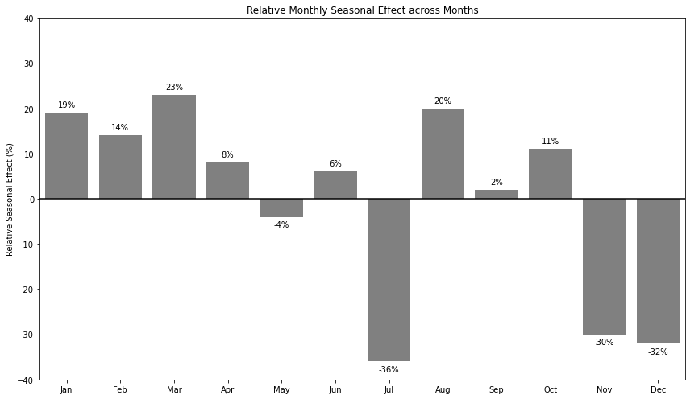

---
jupyter:
  colab:
    name: "FINAL 02807: Project 2.ipynb"
    toc_visible: true
  kernelspec:
    display_name: Python 3
    language: python
    name: python3
  language_info:
    codemirror_mode:
      name: ipython
      version: 3
    file_extension: .py
    mimetype: text/x-python
    name: python
    nbconvert_exporter: python
    pygments_lexer: ipython3
    version: 3.6.6
  nbformat: 4
  nbformat_minor: 0
---

::: {.cell .markdown id="PlsPJUw7wCWZ"}
# 02807: Project 2 {#02807-project-2}

## Practical information

-   This project must be completed in groups of 3 students.
-   This project must be handed in as an \*.ipynb notebook to the course
    site on DTU Inside. Go to the Assignments tab to upload your
    submission.
-   The notebook must be runnable on Google Colab.
-   This project is due on Monday, November 30, 20:00.
-   Each group has to hand in *one* notebook with their solutions.
-   Your code must be written in Python/PySpark.
-   For each question you may use as many cells for your solution as you
    like.
-   You should not remove the problem statements.
-   Your notebook should be runnable, i.e., clicking in the code cells
    should display the result that you want to have assessed.\
-   You are not expected to use machine learning to solve any of the
    exercises.

## Colaboration policy

-   It is not allowed to collaborate on the exercises with students
    outside your group, except for discussing the text of the exercise
    with teachers and fellow students enrolled on the course in the same
    semester.
-   It is not allowed to exchange, hand-over or in any other way
    communicate solutions or parts of solutions to the exercises.
-   It is not allowed to use solutions from similar courses, or
    solutions found elsewhere.
:::

::: {.cell .markdown id="ZP30rwxHDQyG"}
## Contribution table and grading

-   The total amount of points in the project is 105.
-   You have to indicate who has solved each part of each exercise in a
    **contribution table**.
-   The following is an example of a contribution table:

               Exercise 1        Exercise 2        Exercise 3   Exercise 4
  ------------ ----------------- ----------------- ------------ ------------
  **Part 1**   John              Mary              Ann          Mary, Ann
  **Part 2**   Mary              Mary              Ann          John, Ann
  **Part 3**   John, Mary, Ann   John, Ann         John         **n.a.**
  **Part 4**   **n.a.**          Ann               John, Mary   **n.a.**
  **Part 5**   **n.a.**          John, Mary, Ann   **n.a.**     **n.a.**
  **Part 6**   **n.a.**          John, Mary, Ann   **n.a.**     **n.a.**

-   A group member can take credit for solving a part of an exercise
    only if they have contributed **substantially** to the solution.

-   Simple contributions, such as correcting a small bug or
    double-checking the results of functions, are not sufficient for
    taking credit for a solution.

-   Several group members can take credit for the same solution if they
    all have contributed substantially to it.

-   **Each group member must solve at least 105/3=35 points**.

-   **If no name is provided for an exercise\'s part, all group members
    will be assigned responsibility for it**.

-   Group members should decide amongst themselves how to collaborate on
    the project to meet the above-mentioned constraints.\

-   Grades are individual. The grade $\text{grade}(m)$ for a group
    member $m$ ranges from 0 to 10 and is calculated as follows:

    -   $\text{individual-score}(m) = \frac{\text{total number of points for the parts correctly solved by }m}{\text{total number of points for the parts contributed by }m}$

    -   $\text{group-score} = \frac{\text{total number of points correctly solved by any group member}}{\text{total number of points in the project}}$

    -   $\text{grade}(m) = 7.5 \cdot \text{individual-score}(m) + 2.5 \cdot \text{group-score}$

-   **Example**: in the contribution table above, suppose that all parts
    are solved correctly except for those of Exercise 4, which are both
    wrong. Then Ann\'s grade is calculated as follows:

    -   $\text{individual-part}(Ann) = \frac{2.5 + 2.5 + 10 + 10 + 5 + 10 + 5}{2.5 + 2.5 + 10 + 10 + 5 + 10 + 5 + 10 + 10} = \frac{45}{65} = 0.692$

    -   $\text{group-part} = \frac{85}{105} = 0.809$

    -   $\text{grade}(Ann) = 7.14$
:::

::: {.cell .markdown id="m7RWIOjnTvxC"}
# Guidelines

-   Data processing should be done using PySpark. Once data has been
    reduced to aggregate form, you may use collect to extract it into
    Python for visualisation.
-   Your solutions will be evaluated by correctness, code quality and
    interpretability of the output. This means that you have to write
    clean and efficient Spark code that will generate sensible execution
    plans, and that the tables and visualisations that you produce are
    meaningful and easy to read.
-   You may add more cells for your solutions, but you should not modify
    the notebook otherwise.
:::

::: {.cell .markdown id="fFNRs5ehSSjy"}
\#`<font color='red'>`{=html}Additional Guidelines (added
4-Nov)`</font>`{=html}

-   You have to submit an \*.ipynb file that runs on Google Colab. You
    may work on any other platform to develop your solutions, but you
    must make sure that the final form of the notebook is runnable on
    Colab.

-   Do not clear output cells when submitting the \*.ipynb file, so we
    can see the results of your code cell executions without necessarily
    running them.

-   To work with the 2 large files in Project 2, we suggest that you do
    the following:

1.  Create a new google account dedicated exclusively to Project 2.
2.  Use the free 15 GB of Google Drive storage provided with the account
    to store listings.csv and reviews.csv (if necessary, zip the files
    first).
3.  Mount your Google Drive in the runtime\'s virtual machine. This will
    allow you to access the data from your Google Drive. Here is an
    official guide to mounting Drive on Colab:
    <https://colab.research.google.com/notebooks/io.ipynb#scrollTo=p2E4EKhCWEC5>
4.  Now, the two files are available in the \`/content/drive folder of
    your runtime\'s virtual machine.

-   You are allowed to use a different way of storing/reading the two
    large files, but make sure to do so in a way in which we can easily
    run your notebook.
:::

::: {.cell .markdown id="vklet8XdRGVV"}
# Group declaration table

This table must be filled before submission.
:::

::: {.cell .code execution_count="1" colab="{\"height\":325,\"base_uri\":\"https://localhost:8080/\"}" id="chiXA3CzRSA1" outputId="c4ca29e2-9f1f-4605-fb29-833c25a669f9"}
``` {.python}
import pandas as pd

dtu_ids_dict = {'Maria':'marasp',
                'Emil':'s196119',
                'Marius':'s193282'
                }

d = {'Exercise 1' : ["Maria, Marius", "Maria, Marius","Maria, Marius", "Maria, Marius", "Maria, Marius", "", "", "", ""], 
     'Exercise 2' : ["Emil", "Emil", "Emil", "Emil", "Emil", "Emil", "Emil", "Emil", "Emil"],
     } 
  
ct = pd.DataFrame(d, index =['Part 1','Part 2.1','Part 2.2','Part 2.3','Part 2.4','Part 2.5','Part 2.6','Part 3.1','Part 3.2']) 

ct
```

::: {.output .execute_result execution_count="1"}
```{=html}
<div>
<style scoped>
    .dataframe tbody tr th:only-of-type {
        vertical-align: middle;
    }

    .dataframe tbody tr th {
        vertical-align: top;
    }

    .dataframe thead th {
        text-align: right;
    }
</style>
<table border="1" class="dataframe">
  <thead>
    <tr style="text-align: right;">
      <th></th>
      <th>Exercise 1</th>
      <th>Exercise 2</th>
    </tr>
  </thead>
  <tbody>
    <tr>
      <th>Part 1</th>
      <td>Maria, Marius</td>
      <td>Emil</td>
    </tr>
    <tr>
      <th>Part 2.1</th>
      <td>Maria, Marius</td>
      <td>Emil</td>
    </tr>
    <tr>
      <th>Part 2.2</th>
      <td>Maria, Marius</td>
      <td>Emil</td>
    </tr>
    <tr>
      <th>Part 2.3</th>
      <td>Maria, Marius</td>
      <td>Emil</td>
    </tr>
    <tr>
      <th>Part 2.4</th>
      <td>Maria, Marius</td>
      <td>Emil</td>
    </tr>
    <tr>
      <th>Part 2.5</th>
      <td></td>
      <td>Emil</td>
    </tr>
    <tr>
      <th>Part 2.6</th>
      <td></td>
      <td>Emil</td>
    </tr>
    <tr>
      <th>Part 3.1</th>
      <td></td>
      <td>Emil</td>
    </tr>
    <tr>
      <th>Part 3.2</th>
      <td></td>
      <td>Emil</td>
    </tr>
  </tbody>
</table>
</div>
```
:::
:::

::: {.cell .code colab="{\"height\":328,\"base_uri\":\"https://localhost:8080/\"}" id="8ZZmDzc0r5SU" outputId="ebd1de1f-c579-4c4b-eec6-c3ad1a5a23ef"}
``` {.python}
## Contribution table with DTU id
ct.replace(dtu_ids_dict,regex=True)
```

::: {.output .execute_result execution_count="59"}
```{=html}
<div>
<style scoped>
    .dataframe tbody tr th:only-of-type {
        vertical-align: middle;
    }

    .dataframe tbody tr th {
        vertical-align: top;
    }

    .dataframe thead th {
        text-align: right;
    }
</style>
<table border="1" class="dataframe">
  <thead>
    <tr style="text-align: right;">
      <th></th>
      <th>Exercise 1</th>
      <th>Exercise 2</th>
    </tr>
  </thead>
  <tbody>
    <tr>
      <th>Part 1</th>
      <td>marasp, s193282</td>
      <td>s196119</td>
    </tr>
    <tr>
      <th>Part 2.1</th>
      <td>marasp, s193282</td>
      <td>s196119</td>
    </tr>
    <tr>
      <th>Part 2.2</th>
      <td>marasp, s193282</td>
      <td>s196119</td>
    </tr>
    <tr>
      <th>Part 2.3</th>
      <td>marasp, s193282</td>
      <td>s196119</td>
    </tr>
    <tr>
      <th>Part 2.4</th>
      <td>marasp, s193282</td>
      <td>s196119</td>
    </tr>
    <tr>
      <th>Part 2.5</th>
      <td></td>
      <td>s196119</td>
    </tr>
    <tr>
      <th>Part 2.6</th>
      <td></td>
      <td>s196119</td>
    </tr>
    <tr>
      <th>Part 3.1</th>
      <td></td>
      <td>s196119</td>
    </tr>
    <tr>
      <th>Part 3.2</th>
      <td></td>
      <td>s196119</td>
    </tr>
  </tbody>
</table>
</div>
```
:::
:::

::: {.cell .markdown id="-4hk-43Io9sI"}
# Create Spark session and define imports
:::

::: {.cell .code id="1xIpeqwVrzw2"}
``` {.python}
# Set up spark in colab environment

!pip install pyspark
!pip install -U -q PyDrive
!apt install openjdk-8-jdk-headless -qq
import os
os.environ["JAVA_HOME"] = "/usr/lib/jvm/java-8-openjdk-amd64"
```
:::

::: {.cell .code execution_count="3" id="2ftW7yaGo9sJ"}
``` {.python}
# Import the libraries we will need
import pyspark
from pyspark.sql import *
from pyspark.sql import functions as f
from pyspark.sql.types import *
from pyspark import SparkFiles,SparkContext, SparkConf
import pandas as pd
import numpy as np
import matplotlib.pyplot as plt
import seaborn as sns
import re
```
:::

::: {.cell .code execution_count="4" id="BRN1IRA0AoM1"}
``` {.python}
# create the Spark session
conf = SparkConf().set("spark.ui.port", "4050")
#sc = SparkContext.getOrCreate(conf=conf)
sc = pyspark.SparkContext(conf=conf)
spark = SparkSession.builder.getOrCreate()
```
:::

::: {.cell .code colab="{\"base_uri\":\"https://localhost:8080/\"}" id="_727sqTF-EZH" outputId="cc7261dd-e3a7-4b50-eaf7-7a775dee73b7"}
``` {.python}
## Create Spark UI from Colab
!wget https://bin.equinox.io/c/4VmDzA7iaHb/ngrok-stable-linux-amd64.zip
!unzip ngrok-stable-linux-amd64.zip
get_ipython().system_raw('./ngrok http 4050 &')
!curl -s http://localhost:4040/api/tunnels | python3 -c \
    "import sys, json; print(json.load(sys.stdin)['tunnels'][0]['public_url'])"
```

::: {.output .stream .stdout}
    --2020-11-30 11:58:30--  https://bin.equinox.io/c/4VmDzA7iaHb/ngrok-stable-linux-amd64.zip
    Resolving bin.equinox.io (bin.equinox.io)... 54.224.51.10, 34.233.2.239, 34.206.212.97, ...
    Connecting to bin.equinox.io (bin.equinox.io)|54.224.51.10|:443... connected.
    HTTP request sent, awaiting response... 200 OK
    Length: 13773305 (13M) [application/octet-stream]
    Saving to: ‘ngrok-stable-linux-amd64.zip.1’

    ngrok-stable-linux- 100%[===================>]  13.13M  13.3MB/s    in 1.0s    

    2020-11-30 11:58:31 (13.3 MB/s) - ‘ngrok-stable-linux-amd64.zip.1’ saved [13773305/13773305]

    Archive:  ngrok-stable-linux-amd64.zip
    replace ngrok? [y]es, [n]o, [A]ll, [N]one, [r]ename: y
      inflating: ngrok                   
    https://fe9c6eae99d4.ngrok.io
:::
:::

::: {.cell .code execution_count="5" colab="{\"height\":219,\"base_uri\":\"https://localhost:8080/\"}" id="T8G5H9ngteQ-" outputId="22e41726-f28d-4908-c874-b46e5229f587"}
``` {.python}
## See if spark is running
spark
```

::: {.output .execute_result execution_count="5"}
```{=html}
            <div>
                <p><b>SparkSession - in-memory</b></p>
                
        <div>
            <p><b>SparkContext</b></p>

            <p><a href="http://885800b8ae4e:4050">Spark UI</a></p>

            <dl>
              <dt>Version</dt>
                <dd><code>v3.0.1</code></dd>
              <dt>Master</dt>
                <dd><code>local[*]</code></dd>
              <dt>AppName</dt>
                <dd><code>pyspark-shell</code></dd>
            </dl>
        </div>
        
            </div>
        
```
:::
:::

::: {.cell .markdown id="m2en_PI7rphC"}
# Exercise 1: Airbnb analysis (52.5 points) {#exercise-1-airbnb-analysis-525-points}
:::

::: {.cell .markdown id="dPlNQTICo9sH"}
## Introduction

``{=html}

[Airbnb](http://airbnb.com) is an online marketplace for arranging or
offering lodgings. In this exercise you will use Spark to analyze data
obtained from the Airbnb website. The purpose of the analysis is to
extract information about trends and patterns from the data.

The project has two parts.

### Part 1: Loading, describing and preparing the data

There\'s quite a lot of data. Make sure that you can load and correctly
parse the data, and that you understand what the dataset contains. You
should also prepare the data for the analysis in part two.

### Par 2: Analysis

In this part your goal is to learn about trends and usage patterns from
the data. You should give solutions to the tasks defined in this
notebook, and you should use Spark to do the data processing. You may
use other libraries like for instance Pandas and matplotlib for
visualisation.
:::

::: {.cell .markdown id="irkTU3UWo9sM"}
## Part 1: Loading, describing and preparing the data (2.5 pts) {#part-1-loading-describing-and-preparing-the-data-25-pts}

The data comes in two files. Start by downloading the files.

-   [Listings](https://files.dtu.dk/u/lT8jJJs_IyiHPyMs/listings.csv?l)
    (5 GB)
-   [Reviews](https://files.dtu.dk/u/yH8FBcZ_BQjafwUN/reviews.csv?l)
    (9.5 GB)
:::

::: {.cell .markdown id="mPtdLqvto9sN"}
### Load the data

The data has multiline rows (rows that span multiple lines in the file).
To correctly parse these you should use the `multiLine` option and set
the `escape` character to be `"`.
:::

::: {.cell .code id="552LDZV2_IIJ"}
``` {.python}
#listings_url = 'https://files.dtu.dk/fss/public/link/public/stream/read/reviews.csv?linkToken=yH8FBcZ_BQjafwUN&itemName=reviews.csv'
#reviews_url = 'https://files.dtu.dk/fss/public/link/public/stream/read/reviews.csv?linkToken=yH8FBcZ_BQjafwUN&itemName=reviews.csv'
```
:::

::: {.cell .code execution_count="6" colab="{\"base_uri\":\"https://localhost:8080/\"}" id="DmBKEp_s_1mw" outputId="e8014ead-13dc-4c1e-f8aa-fefbdaef849a"}
``` {.python}
from google.colab import drive
# This will prompt for authorization.

#drive.mount('/content/sample_data')
drive.mount('/content/gdrive', force_remount=True)

import os
import urllib.request
```

::: {.output .stream .stdout}
    Mounted at /content/gdrive
:::
:::

::: {.cell .code colab="{\"base_uri\":\"https://localhost:8080/\"}" id="Mw7lFhITCXbf" outputId="4af32657-b988-45a2-951e-3ffd42915838"}
``` {.python}
#lil=urllib.request.urlretrieve(listings_url,'/content/sample_data/listings.csv')
#rev=urllib.request.urlretrieve(reviews_url,'/content/sample_data/reviews.csv')

#!ls '/content/sample_data'

!ls '/content/gdrive/MyDrive/listings.csv'
!ls '/content/gdrive/MyDrive/reviews.csv'

```

::: {.output .stream .stdout}
    /content/gdrive/MyDrive/listings.csv
    /content/gdrive/MyDrive/reviews.csv
:::
:::

::: {.cell .code execution_count="8" id="K5kDvbDoo9sN"}
``` {.python}
## Read the two csv files
df_listings = spark.read.option('header', True).option('inferSchema', True).option('multiLine', 'true').option('escape', "\"").csv('/content/gdrive/MyDrive/listings.csv')
df_reviews = spark.read.option('header', True).option('inferSchema', True).option('multiLine', 'true').option('escape', "\"").csv('/content/gdrive/MyDrive/reviews.csv')
```
:::

::: {.cell .markdown id="HV89khYqo9sQ"}
### Describe the data

List the features (schema) and sizes of the datasets.
:::

::: {.cell .code colab="{\"base_uri\":\"https://localhost:8080/\"}" id="Bp1qkXQTo9sR" outputId="17aa3201-c6d3-4b76-c9b0-147fc043843a"}
``` {.python}
print('Schema for listings:')
df_listings.printSchema()
print('Schema for reviews:')
df_reviews.printSchema()

## Count number of rows and columns in df
print('Number of rows and columns in listings data frame:')
print((df_listings.count(), len(df_listings.columns)))
print('Number of rows and columns in reviews data frame:')
print((df_reviews.count(), len(df_reviews.columns)))

## Print three rows from each data frame
print('First 20 lines of listings data frame:')
df_listings.show()   ## Can be hard to see, many columns
print('First 20 lines of reviews data frame:')
df_reviews.show()
```

::: {.output .stream .stdout}
    Schema for listings:
    root
     |-- id: string (nullable = true)
     |-- listing_url: string (nullable = true)
     |-- scrape_id: string (nullable = true)
     |-- last_scraped: string (nullable = true)
     |-- name: string (nullable = true)
     |-- summary: string (nullable = true)
     |-- space: string (nullable = true)
     |-- description: string (nullable = true)
     |-- experiences_offered: string (nullable = true)
     |-- neighborhood_overview: string (nullable = true)
     |-- notes: string (nullable = true)
     |-- transit: string (nullable = true)
     |-- access: string (nullable = true)
     |-- interaction: string (nullable = true)
     |-- house_rules: string (nullable = true)
     |-- thumbnail_url: string (nullable = true)
     |-- medium_url: string (nullable = true)
     |-- picture_url: string (nullable = true)
     |-- xl_picture_url: string (nullable = true)
     |-- host_id: string (nullable = true)
     |-- host_url: string (nullable = true)
     |-- host_name: string (nullable = true)
     |-- host_since: string (nullable = true)
     |-- host_location: string (nullable = true)
     |-- host_about: string (nullable = true)
     |-- host_response_time: string (nullable = true)
     |-- host_response_rate: string (nullable = true)
     |-- host_acceptance_rate: string (nullable = true)
     |-- host_is_superhost: string (nullable = true)
     |-- host_thumbnail_url: string (nullable = true)
     |-- host_picture_url: string (nullable = true)
     |-- host_neighbourhood: string (nullable = true)
     |-- host_listings_count: string (nullable = true)
     |-- host_total_listings_count: string (nullable = true)
     |-- host_verifications: string (nullable = true)
     |-- host_has_profile_pic: string (nullable = true)
     |-- host_identity_verified: string (nullable = true)
     |-- street: string (nullable = true)
     |-- neighbourhood: string (nullable = true)
     |-- neighbourhood_cleansed: string (nullable = true)
     |-- neighbourhood_group_cleansed: string (nullable = true)
     |-- city: string (nullable = true)
     |-- state: string (nullable = true)
     |-- zipcode: string (nullable = true)
     |-- market: string (nullable = true)
     |-- smart_location: string (nullable = true)
     |-- country_code: string (nullable = true)
     |-- country: string (nullable = true)
     |-- latitude: string (nullable = true)
     |-- longitude: string (nullable = true)
     |-- is_location_exact: string (nullable = true)
     |-- property_type: string (nullable = true)
     |-- room_type: string (nullable = true)
     |-- accommodates: string (nullable = true)
     |-- bathrooms: string (nullable = true)
     |-- bedrooms: string (nullable = true)
     |-- beds: string (nullable = true)
     |-- bed_type: string (nullable = true)
     |-- amenities: string (nullable = true)
     |-- square_feet: string (nullable = true)
     |-- price: string (nullable = true)
     |-- weekly_price: string (nullable = true)
     |-- monthly_price: string (nullable = true)
     |-- security_deposit: string (nullable = true)
     |-- cleaning_fee: string (nullable = true)
     |-- guests_included: string (nullable = true)
     |-- extra_people: string (nullable = true)
     |-- minimum_nights: string (nullable = true)
     |-- maximum_nights: string (nullable = true)
     |-- minimum_minimum_nights: string (nullable = true)
     |-- maximum_minimum_nights: string (nullable = true)
     |-- minimum_maximum_nights: string (nullable = true)
     |-- maximum_maximum_nights: string (nullable = true)
     |-- minimum_nights_avg_ntm: string (nullable = true)
     |-- maximum_nights_avg_ntm: string (nullable = true)
     |-- calendar_updated: string (nullable = true)
     |-- has_availability: string (nullable = true)
     |-- availability_30: string (nullable = true)
     |-- availability_60: string (nullable = true)
     |-- availability_90: string (nullable = true)
     |-- availability_365: string (nullable = true)
     |-- calendar_last_scraped: string (nullable = true)
     |-- number_of_reviews: string (nullable = true)
     |-- number_of_reviews_ltm: string (nullable = true)
     |-- first_review: string (nullable = true)
     |-- last_review: string (nullable = true)
     |-- review_scores_rating: string (nullable = true)
     |-- review_scores_accuracy: string (nullable = true)
     |-- review_scores_cleanliness: string (nullable = true)
     |-- review_scores_checkin: string (nullable = true)
     |-- review_scores_communication: string (nullable = true)
     |-- review_scores_location: string (nullable = true)
     |-- review_scores_value: string (nullable = true)
     |-- requires_license: string (nullable = true)
     |-- license: string (nullable = true)
     |-- jurisdiction_names: string (nullable = true)
     |-- instant_bookable: string (nullable = true)
     |-- is_business_travel_ready: string (nullable = true)
     |-- cancellation_policy: string (nullable = true)
     |-- require_guest_profile_picture: string (nullable = true)
     |-- require_guest_phone_verification: string (nullable = true)
     |-- calculated_host_listings_count: string (nullable = true)
     |-- calculated_host_listings_count_entire_homes: string (nullable = true)
     |-- calculated_host_listings_count_private_rooms: string (nullable = true)
     |-- calculated_host_listings_count_shared_rooms: string (nullable = true)
     |-- reviews_per_month: string (nullable = true)

    Schema for reviews:
    root
     |-- listing_id: string (nullable = true)
     |-- id: string (nullable = true)
     |-- date: string (nullable = true)
     |-- reviewer_id: string (nullable = true)
     |-- reviewer_name: string (nullable = true)
     |-- comments: string (nullable = true)

    Number of rows and columns in listings data frame:
    (1330480, 106)
    Number of rows and columns in reviews data frame:
    (32297300, 6)
    First 20 lines of listings data frame:
    +------+--------------------+--------------+------------+--------------------+--------------------+--------------------+--------------------+-------------------+---------------------+--------------------+--------------------+--------------------+--------------------+--------------------+-------------+----------+--------------------+--------------+-------+--------------------+---------+----------+--------------------+--------------------+------------------+------------------+--------------------+-----------------+--------------------+--------------------+------------------+-------------------+-------------------------+--------------------+--------------------+----------------------+--------------------+-------------+----------------------+----------------------------+---------+----------------+-------+---------+-----------------+------------+-------+--------+---------+-----------------+-----------------+---------------+------------+---------+--------+----+--------+--------------------+-----------+---------+------------+-------------+----------------+------------+---------------+------------+--------------+--------------+----------------------+----------------------+----------------------+----------------------+----------------------+----------------------+----------------+----------------+---------------+---------------+---------------+----------------+---------------------+-----------------+---------------------+------------+-----------+--------------------+----------------------+-------------------------+---------------------+---------------------------+----------------------+-------------------+----------------+-------+------------------+----------------+------------------------+--------------------+-----------------------------+--------------------------------+------------------------------+-------------------------------------------+--------------------------------------------+-------------------------------------------+-----------------+
    |    id|         listing_url|     scrape_id|last_scraped|                name|             summary|               space|         description|experiences_offered|neighborhood_overview|               notes|             transit|              access|         interaction|         house_rules|thumbnail_url|medium_url|         picture_url|xl_picture_url|host_id|            host_url|host_name|host_since|       host_location|          host_about|host_response_time|host_response_rate|host_acceptance_rate|host_is_superhost|  host_thumbnail_url|    host_picture_url|host_neighbourhood|host_listings_count|host_total_listings_count|  host_verifications|host_has_profile_pic|host_identity_verified|              street|neighbourhood|neighbourhood_cleansed|neighbourhood_group_cleansed|     city|           state|zipcode|   market|   smart_location|country_code|country|latitude|longitude|is_location_exact|    property_type|      room_type|accommodates|bathrooms|bedrooms|beds|bed_type|           amenities|square_feet|    price|weekly_price|monthly_price|security_deposit|cleaning_fee|guests_included|extra_people|minimum_nights|maximum_nights|minimum_minimum_nights|maximum_minimum_nights|minimum_maximum_nights|maximum_maximum_nights|minimum_nights_avg_ntm|maximum_nights_avg_ntm|calendar_updated|has_availability|availability_30|availability_60|availability_90|availability_365|calendar_last_scraped|number_of_reviews|number_of_reviews_ltm|first_review|last_review|review_scores_rating|review_scores_accuracy|review_scores_cleanliness|review_scores_checkin|review_scores_communication|review_scores_location|review_scores_value|requires_license|license|jurisdiction_names|instant_bookable|is_business_travel_ready| cancellation_policy|require_guest_profile_picture|require_guest_phone_verification|calculated_host_listings_count|calculated_host_listings_count_entire_homes|calculated_host_listings_count_private_rooms|calculated_host_listings_count_shared_rooms|reviews_per_month|
    +------+--------------------+--------------+------------+--------------------+--------------------+--------------------+--------------------+-------------------+---------------------+--------------------+--------------------+--------------------+--------------------+--------------------+-------------+----------+--------------------+--------------+-------+--------------------+---------+----------+--------------------+--------------------+------------------+------------------+--------------------+-----------------+--------------------+--------------------+------------------+-------------------+-------------------------+--------------------+--------------------+----------------------+--------------------+-------------+----------------------+----------------------------+---------+----------------+-------+---------+-----------------+------------+-------+--------+---------+-----------------+-----------------+---------------+------------+---------+--------+----+--------+--------------------+-----------+---------+------------+-------------+----------------+------------+---------------+------------+--------------+--------------+----------------------+----------------------+----------------------+----------------------+----------------------+----------------------+----------------+----------------+---------------+---------------+---------------+----------------+---------------------+-----------------+---------------------+------------+-----------+--------------------+----------------------+-------------------------+---------------------+---------------------------+----------------------+-------------------+----------------+-------+------------------+----------------+------------------------+--------------------+-----------------------------+--------------------------------+------------------------------+-------------------------------------------+--------------------------------------------+-------------------------------------------+-----------------+
    |145320|https://www.airbn...|20190928160308|  2019-09-28|In the middle of ...|Mitt boende passa...|A cozy three room...|Mitt boende passa...|               none| The flat is in th...|                null|My flat is close ...|You can stay in e...|Just ask me every...|No smoking inside...|         null|      null|https://a0.muscac...|          null| 703851|https://www.airbn...|      Kim|2011-06-15|Stockholm, Stockh...|Hi, I'm Kim, a de...|               N/A|               N/A|                 N/A|                t|https://a0.muscac...|https://a0.muscac...|              null|                  1|                        1|['email', 'phone'...|                   t|                     t|Stockholm, Stockh...|    Södermalm|            Södermalms|                        null|Stockholm|  Stockholms län| 118 53|Stockholm|Stockholm, Sweden|          SE| Sweden|59.31364| 18.05256|                f|        Apartment|   Private room|           2|      1.0|       1|   2|Real Bed|{TV,"Cable TV",Wi...|       null|$1,272.00|        null|         null|            null|     $417.00|              2|       $0.00|             2|          1125|                     2|                     2|                  1125|                  1125|                   2.0|                1125.0|    3 months ago|               t|              0|              0|             26|              26|           2019-09-28|               72|                   27|  2017-05-30| 2019-06-25|                  97|                    10|                       10|                   10|                         10|                    10|                 10|               f|   null|              null|               t|                       f|strict_14_with_gr...|                            f|                               f|                             1|                                          0|                                           1|                                          0|             2.54|
    |155220|https://www.airbn...|20190928160308|  2019-09-28|Stockholm, new sp...|Convenient and sp...|ABOUT THE HOUSE: ...|ABOUT THE HOUSE: ...|               none| Close to nature a...|Bikes to borrow a...|Yes regular busse...|Everything in the...|I will make you f...|          No smoking|         null|      null|https://a0.muscac...|          null| 746396|https://www.airbn...|Madeleine|2011-06-26|Stockholm, Stockh...|I work with human...|within a few hours|               63%|                 N/A|                f|https://a0.muscac...|https://a0.muscac...|              null|                  2|                        2|['email', 'phone'...|                   t|                     f|Stockholm, Stockh...|    Skarpnäck|            Skarpnäcks|                        null|Stockholm|Stockholm County|   null|Stockholm|Stockholm, Sweden|          SE| Sweden|59.24667| 18.17799|                f|            House|Entire home/apt|           3|      1.0|       2|   3|Real Bed|{TV,"Cable TV",In...|          0|$1,203.00|   $4,000.00|   $15,000.00|       $3,000.00|   $1,000.00|              3|     $500.00|             3|           730|                     3|                     3|                   730|                   730|                   3.0|                 730.0|    8 months ago|               t|              0|              0|              0|               0|           2019-09-28|                0|                    0|        null|       null|                null|                  null|                     null|                 null|                       null|                  null|               null|               f|   null|              null|               f|                       f|            moderate|                            f|                               f|                             2|                                          2|                                           0|                                          0|             null|
    |155685|https://www.airbn...|20190928160308|  2019-09-28|Hornstull with wa...|This apartment is...|46 sqm apartment ...|This apartment is...|               none| There is a funky ...|                null|Very close to pub...|Everything in the...|I meet in most ar...|•  The person tha...|         null|      null|https://a0.muscac...|          null| 748592|https://www.airbn...|   Robert|2011-06-27|Stockholm, Stockh...|Robert work with ...|               N/A|               N/A|                 N/A|                f|https://a0.muscac...|https://a0.muscac...|              null|                  1|                        1|['email', 'phone'...|                   t|                     f|Stockholm, Stockh...|    Södermalm|            Södermalms|                        null|Stockholm|Stockholm County|  11739|Stockholm|Stockholm, Sweden|          SE| Sweden|59.31535| 18.03277|                t|        Apartment|Entire home/apt|           2|      1.0|       2|   2|Real Bed|{TV,Wifi,Kitchen,...|       null|$3,209.00|        null|   $17,111.00|            null|        null|              1|       $0.00|             4|           365|                     4|                     4|                   365|                   365|                   4.0|                 365.0|    4 months ago|               t|              0|              0|              0|               0|           2019-09-28|               22|                    0|  2011-08-23| 2015-12-01|                  94|                     9|                       10|                   10|                         10|                     9|                  9|               f|   null|              null|               f|                       f|            moderate|                            f|                               f|                             1|                                          1|                                           0|                                          0|             0.22|
    |164448|https://www.airbn...|20190928160308|  2019-09-28|Double room in ce...|I am renting out ...|ROOM: The room ha...|I am renting out ...|               none|                 null|                null|                null|                null|                null|All the other fac...|         null|      null|https://a0.muscac...|          null| 784312|https://www.airbn...|       Li|2011-07-06|Stockholm, Stockh...|I am a recently r...|    within an hour|              100%|                 N/A|                t|https://a0.muscac...|https://a0.muscac...|         Södermalm|                  2|                        2|['email', 'phone'...|                   t|                     t|Stockholm, Stockh...|    Södermalm|            Södermalms|                        null|Stockholm|Stockholm County|  11864|Stockholm|Stockholm, Sweden|          SE| Sweden|59.31268| 18.06258|                t|        Apartment|   Private room|           2|      1.0|       1|   2|Real Bed|{TV,Internet,Wifi...|       null|  $597.00|   $4,000.00|   $12,000.00|            null|        null|              1|       $0.00|             3|           300|                     3|                     3|                   300|                   300|                   3.0|                 300.0|     2 weeks ago|               t|             15|             37|             59|             140|           2019-09-28|              311|                   55|  2011-07-30| 2019-09-26|                  97|                    10|                       10|                   10|                         10|                    10|                 10|               f|   null|              null|               t|                       f|            flexible|                            t|                               t|                             2|                                          0|                                           2|                                          0|             3.13|
    |170651|https://www.airbn...|20190928160308|  2019-09-28|Petit Charm Rooft...|                null|Welcome to this b...|Welcome to this b...|               none|                 null|                null|                null|                null|                null|I like to have th...|         null|      null|https://a0.muscac...|          null| 814021|https://www.airbn...|    Marie|2011-07-13|Stockholm, Stockh...|Im a happy person...|within a few hours|              100%|                 N/A|                f|https://a0.muscac...|https://a0.muscac...|         Södermalm|                  1|                        1|['email', 'phone'...|                   t|                     f|Stockholm, Stockh...|    Södermalm|            Södermalms|                        null|Stockholm|Stockholm County|  11737|Stockholm|Stockholm, Sweden|          SE| Sweden|59.31568| 18.03138|                t|        Apartment|Entire home/apt|           4|      1.0|       1|   2|Real Bed|{Internet,Wifi,Ki...|       null|  $734.00|        null|   $18,181.00|       $2,139.00|     $321.00|              2|     $321.00|             3|            30|                     3|                     3|                    30|                    30|                   3.0|                  30.0|     6 weeks ago|               t|             13|             38|             58|             216|           2019-09-28|               33|                    7|  2011-08-14| 2019-09-01|                  93|                    10|                        9|                   10|                         10|                    10|                  9|               f|   null|              null|               f|                       f|strict_14_with_gr...|                            f|                               f|                             1|                                          1|                                           0|                                          0|             0.33|
    |206221|https://www.airbn...|20190928160308|  2019-09-28|Doubleroom at Söd...|                null|The region is sit...|The region is sit...|               none|                 null|                null|                null|                null|                null|                null|         null|      null|https://a0.muscac...|          null|1022374|https://www.airbn...|Elisabeth|2011-08-26|              Sweden|I'm a positive pe...|      within a day|               50%|                 N/A|                f|https://a0.muscac...|https://a0.muscac...|              null|                  1|                        1|['email', 'phone'...|                   t|                     f|Stockholm, Stockh...|    Södermalm|            Södermalms|                        null|Stockholm|Stockholm County|  11639|Stockholm|Stockholm, Sweden|          SE| Sweden|59.31226| 18.07942|                t|Bed and breakfast|    Shared room|           2|      1.0|       1|   2|Real Bed|{Wifi,Breakfast,E...|         96|  $665.00|        null|         null|            null|        null|              2|     $200.00|             3|            14|                     3|                     3|                    14|                    14|                   3.0|                  14.0|     2 weeks ago|               t|              2|             25|             55|             330|           2019-09-28|               78|                   12|  2011-11-30| 2019-08-13|                  98|                    10|                       10|                   10|                         10|                    10|                 10|               f|   null|              null|               f|                       f|            flexible|                            f|                               f|                             1|                                          0|                                           0|                                          1|             0.82|
    |220233|https://www.airbn...|20190928160308|  2019-09-28|Central apartment...|My apartment is l...|38 sqm apartment ...|My apartment is l...|               none| The apartment is ...|The apartment win...|Subway station (t...|As a guest you wi...|I'm happy to prov...|I trust my guests...|         null|      null|https://a0.muscac...|          null|1137208|https://www.airbn...|  Martina|2011-09-10|Stockholm, Stockh...|Want to enjoy the...|               N/A|               N/A|                 N/A|                f|https://a0.muscac...|https://a0.muscac...|          Norrmalm|                  1|                        1|['email', 'phone'...|                   t|                     f|Stockholm, Stockh...|     Norrmalm|             Norrmalms|                        null|Stockholm|  Stockholms län|  11320|Stockholm|Stockholm, Sweden|          SE| Sweden|59.33948| 18.03551|                t|        Apartment|Entire home/apt|           2|      1.0|       1|   2|Real Bed|{TV,Internet,Wifi...|       null|  $890.00|        null|   $10,500.00|            null|        null|              1|       $0.00|             3|           365|                     3|                     3|                   365|                   365|                   3.0|                 365.0|   33 months ago|               t|              0|              0|              0|               0|           2019-09-28|                0|                    0|        null|       null|                null|                  null|                     null|                 null|                       null|                  null|               null|               f|   null|              null|               f|                       f|            moderate|                            f|                               f|                             1|                                          1|                                           0|                                          0|             null|
    |220851|https://www.airbn...|20190928160308|  2019-09-28|One room in appar...|            Welcome!|Welcome! One big ...|Welcome! Welcome!...|               none| Many restaurangs ...|No smoking No par...|          3 min walk|   Kitchen,bathroom.|Sometimes i am at...|no smoking in the...|         null|      null|https://a0.muscac...|          null| 412283|https://www.airbn...|  Fredric|2011-02-27|Stockholm, Stockh...|I am into arts yo...|within a few hours|               83%|                 N/A|                f|https://a0.muscac...|https://a0.muscac...|       Kungsholmen|                  1|                        1|['email', 'phone'...|                   t|                     f|Stockholm, Stockh...|  Kungsholmen|          Kungsholmens|                        null|Stockholm|Stockholm County|  11341|Stockholm|Stockholm, Sweden|          SE| Sweden|59.33376| 18.03816|                t|        Apartment|   Private room|           1|      1.0|       1|   1|Real Bed|{Wifi,Kitchen,Ele...|       null|  $597.00|   $4,000.00|   $15,000.00|            null|     $300.00|              1|       $0.00|             3|            20|                     3|                     3|                    20|                    20|                   3.0|                  20.0|     6 weeks ago|               t|             19|             49|             79|             354|           2019-09-28|               45|                   10|  2011-09-29| 2019-08-23|                  93|                     9|                        9|                   10|                         10|                    10|                  9|               f|   null|              null|               f|                       f|            flexible|                            f|                               f|                             1|                                          0|                                           1|                                          0|             0.46|
    |242188|https://www.airbn...|20190928160308|  2019-09-28|Single room in ce...|I am renting out ...|ROOM:  The room h...|I am renting out ...|               none|                 null|                null|                null|                null|                null|A modern five bed...|         null|      null|https://a0.muscac...|          null| 784312|https://www.airbn...|       Li|2011-07-06|Stockholm, Stockh...|I am a recently r...|    within an hour|              100%|                 N/A|                t|https://a0.muscac...|https://a0.muscac...|         Södermalm|                  2|                        2|['email', 'phone'...|                   t|                     t|Stockholm, Stockh...|    Södermalm|            Södermalms|                        null|Stockholm|Stockholm County|  11864|Stockholm|Stockholm, Sweden|          SE| Sweden|59.31347| 18.06106|                t|        Apartment|   Private room|           1|      1.0|       1|   1|Real Bed|{TV,Internet,Wifi...|       null|  $558.00|   $3,000.00|    $8,500.00|            null|        null|              1|       $0.00|             2|           300|                     2|                     2|                   300|                   300|                   2.0|                 300.0|     3 weeks ago|               t|             13|             35|             54|             139|           2019-09-28|              296|                   51|  2012-02-13| 2019-09-26|                  97|                    10|                       10|                   10|                         10|                    10|                 10|               f|   null|              null|               t|                       f|            flexible|                            t|                               t|                             2|                                          0|                                           2|                                          0|             3.19|
    |259025|https://www.airbn...|20190928160308|  2019-09-28|sufficient large ...|                null|If I describe how...|If I describe how...|               none|                 null|Kista mall, Stock...|Rinkeby Metro Sta...|When you are four...|                null|Do not allow anim...|         null|      null|https://a0.muscac...|          null|1361093|https://www.airbn...|      Ali|2011-11-02|Stockholm, Stockh...|Come and enjoy St...|    within an hour|              100%|                 N/A|                f|https://a0.muscac...|https://a0.muscac...|              null|                  3|                        3|['email', 'phone'...|                   t|                     t|Stockholm, Stockh...|Rinkeby-Kista|        Rinkeby-Tensta|                        null|Stockholm|Stockholm County|  16371|Stockholm|Stockholm, Sweden|          SE| Sweden|59.38682| 17.92276|                t|        Townhouse|   Private room|           1|      1.0|       1|   1|Real Bed|{TV,"Cable TV",In...|          0|  $196.00|        null|    $8,657.00|            null|     $200.00|              1|     $100.00|            60|          1000|                    60|                    60|                  1000|                  1000|                  60.0|                1000.0|   10 months ago|               t|             30|             60|             90|             365|           2019-09-28|               60|                    0|  2011-11-23| 2015-11-08|                  89|                     9|                       10|                    9|                          9|                     7|                  9|               f|   null|              null|               f|                       f|strict_14_with_gr...|                            t|                               t|                             2|                                          0|                                           2|                                          0|             0.63|
    |259722|https://www.airbn...|20190928160308|  2019-09-28|Near shopping-IT ...|It's a nice and c...|It's a nice and c...|It's a nice and c...|               none|                 null|It's good if you ...|                null|You have your own...|I'm not at home s...|I want a copy of ...|         null|      null|https://a0.muscac...|          null|1261494|https://www.airbn...|  Marcelo|2011-10-07|Stockholm, Stockh...|Hi! 
    I am an IT-...|within a few hours|              100%|                 N/A|                f|https://a0.muscac...|https://a0.muscac...|              null|                  1|                        1|['email', 'phone'...|                   t|                     t|Stockholm, Stockh...|Rinkeby-Kista|        Rinkeby-Tensta|                        null|Stockholm|Stockholm County|  16474|Stockholm|Stockholm, Sweden|          SE| Sweden|59.41003|  17.9366|                t|        Apartment|   Private room|           2|      1.0|       1|   2|Real Bed|{TV,"Cable TV",In...|        560|  $225.00|   $2,567.00|    $7,700.00|       $1,069.00|     $535.00|              1|     $267.00|            21|           365|                    21|                    21|                   365|                   365|                  21.0|                 365.0|    5 months ago|               t|              0|             17|             47|             322|           2019-09-28|               23|                    2|  2012-03-01| 2019-05-13|                  92|                     9|                       10|                    9|                          9|                     9|                  8|               f|   null|              null|               f|                       f|strict_14_with_gr...|                            f|                               f|                             1|                                          0|                                           1|                                          0|             0.25|
    |273906|https://www.airbn...|20190928160308|  2019-09-28|Penthouse in cent...|                null|This is a unique ...|This is a unique ...|               none|                 null|                null|                null|                null|                null|One of the main r...|         null|      null|https://a0.muscac...|          null|1432722|https://www.airbn...|  Rodrigo|2011-11-22|Stockholm, Stockh...|I am from Chile a...|    within an hour|              100%|                 N/A|                f|https://a0.muscac...|https://a0.muscac...|         Södermalm|                  2|                        2|['email', 'phone'...|                   t|                     f|Stockholm, Stockh...|    Skarpnäck|            Södermalms|                        null|Stockholm|Stockholm County|  12068|Stockholm|Stockholm, Sweden|          SE| Sweden|59.30414|  18.1068|                t|        Apartment|Entire home/apt|           4|      2.0|       3|   3|Real Bed|{TV,"Cable TV",In...|       1399|$1,957.00|  $12,719.00|   $48,918.00|           $0.00|   $1,223.00|              1|       $0.00|             6|            30|                     6|                     6|                    30|                    30|                   6.0|                  30.0|    5 months ago|               t|              0|              0|              0|             270|           2019-09-28|                8|                    0|  2012-07-19| 2018-07-07|                 100|                    10|                       10|                   10|                         10|                    10|                 10|               f|   null|              null|               t|                       f|strict_14_with_gr...|                            f|                               f|                             1|                                          1|                                           0|                                          0|             0.09|
    |274876|https://www.airbn...|20190928160308|  2019-09-28|Designer apartmen...|                null|Hej and welcome! ...|Hej and welcome! ...|               none| A quiet neighbour...|Check-in time is ...|Bus: Just outside...|                null|You can always re...|                null|         null|      null|https://a0.muscac...|          null|1437153|https://www.airbn...|     Emma|2011-11-23|Stockholm, Stockh...|Hi, this is my pl...|within a few hours|              100%|                 N/A|                t|https://a0.muscac...|https://a0.muscac...|              null|                  1|                        1|['email', 'phone'...|                   t|                     f|Stockholm, Stockh...|    Södermalm|            Södermalms|                        null|Stockholm|Stockholm County|  11628|Stockholm|Stockholm, Sweden|          SE| Sweden|59.31849| 18.09536|                t|        Apartment|Entire home/apt|           5|      1.0|       3|   5|Real Bed|{TV,"Cable TV",In...|       null|$3,150.00|        null|         null|       $4,278.00|   $1,069.00|              5|     $428.00|             4|           100|                     4|                     4|                   100|                   100|                   4.0|                 100.0|     6 weeks ago|               t|             27|             57|             87|             362|           2019-09-28|              113|                   23|  2012-04-29| 2019-09-22|                  99|                    10|                       10|                   10|                         10|                    10|                  9|               f|   null|              null|               f|                       f|            moderate|                            t|                               t|                             1|                                          1|                                           0|                                          0|             1.25|
    |278311|https://www.airbn...|20190928160308|  2019-09-28|Entire apt (some ...|When we will be a...|This awesome plac...|When we will be a...|               none| I love the lake, ...|                null|I love the public...|The entire apt, t...|I won't be around...|If you'd like to ...|         null|      null|https://a0.muscac...|          null|1452838|https://www.airbn...|   Linnéa|2011-11-29|Stockholm, Stockh...|Playful, fun-lovi...|within a few hours|              100%|                 N/A|                f|https://a0.muscac...|https://a0.muscac...|            Farsta|                  1|                        1|['email', 'phone'...|                   t|                     f|Farsta, Stockholm...|       Farsta|                Farsta|                        null|   Farsta|  Stockholms län|  12331|Stockholm|   Farsta, Sweden|          SE| Sweden|59.24534| 18.08729|                t|        Apartment|Entire home/apt|           6|      1.0|       1|   3|Real Bed|{Internet,Wifi,Ki...|        936|  $411.00|   $3,300.00|   $12,900.00|       $1,000.00|     $200.00|              1|     $250.00|             1|            30|                     1|                     1|                    30|                    30|                   1.0|                  30.0|     4 weeks ago|               t|             13|             43|             73|             348|           2019-09-28|               52|                    4|  2011-12-16| 2019-09-06|                  92|                     9|                        9|                   10|                         10|                     9|                  9|               f|   null|              null|               f|                       f|            moderate|                            f|                               f|                             1|                                          1|                                           0|                                          0|             0.55|
    |283446|https://www.airbn...|20190928160308|  2019-09-28|Comfort Stay @ Ki...|Independent priva...|Independent priva...|Independent priva...|               none| Our apartment is ...|Metro is availabl...|Our apartment is ...|hi-speed internet...|we ask few questi...|•VEGETARIAN FOOD ...|         null|      null|https://a0.muscac...|          null|1476562|https://www.airbn...| Vidhatri|2011-12-06|Stockholm, Stockh...|Hi..I am Vidhatri...|               N/A|               N/A|                 N/A|                f|https://a0.muscac...|https://a0.muscac...|     Rinkeby-Kista|                  1|                        1|['email', 'phone'...|                   t|                     t|Stockholm, Stockh...|Rinkeby-Kista|        Rinkeby-Tensta|                        null|Stockholm|Stockholm County|  16472|Stockholm|Stockholm, Sweden|          SE| Sweden|59.41533| 17.91465|                t|        Apartment|   Private room|           2|      1.0|       1|   2|Real Bed|{TV,"Cable TV",In...|        958|  $294.00|   $3,023.00|    $9,850.00|            null|        null|              1|     $175.00|             2|          1125|                     2|                     2|                  1125|                  1125|                   2.0|                1125.0|    4 months ago|               t|              0|              0|              6|               6|           2019-09-28|              104|                    1|  2012-07-03| 2018-10-28|                  97|                    10|                       10|                   10|                         10|                     9|                 10|               f|   null|              null|               t|                       f|            moderate|                            f|                               f|                             1|                                          0|                                           1|                                          0|             1.18|
    |299154|https://www.airbn...|20190928160308|  2019-09-28|Cosy apartment ce...|Very centrally lo...|An small apartmen...|Very centrally lo...|               none| Södermalm, often ...|Keys Leave the ke...|The subway is jus...|Hole apartment wi...|I interact with g...|Keys Leave the ke...|         null|      null|https://a0.muscac...|          null|1541953|https://www.airbn...|   Daniel|2011-12-28|Stockholm, Stockh...|Nice and friendly...|    within an hour|              100%|                 N/A|                f|https://a0.muscac...|https://a0.muscac...|         Södermalm|                  1|                        1|['email', 'phone'...|                   t|                     t|Stockholm, Stockh...|    Södermalm|            Södermalms|                        null|Stockholm|Stockholm County|  11846|Stockholm|Stockholm, Sweden|          SE| Sweden|59.31767| 18.07137|                t|        Apartment|Entire home/apt|           4|      1.0|       1|   2|Real Bed|{TV,"Cable TV",In...|        312|$1,106.00|        null|         null|       $1,500.00|       $0.00|              2|     $135.00|             2|            60|                     1|                     3|                    60|                    60|                   2.0|                  60.0|      a week ago|               t|              5|             26|             43|             232|           2019-09-28|              480|                   63|  2013-06-16| 2019-09-27|                  92|                    10|                        9|                   10|                         10|                    10|                  9|               f|   null|              null|               t|                       f|strict_14_with_gr...|                            f|                               t|                             1|                                          1|                                           0|                                          0|             6.27|
    |301680|https://www.airbn...|20190928160308|  2019-09-28|one cosy double r...|there are several...|Your room is cosy...|there are several...|               none| Beautiful surroun...|There is recyklin...|Just around the c...|A modern kitchen ...|If you enjoy fitn...|I expect that whe...|         null|      null|https://a0.muscac...|          null|1554143|https://www.airbn...|   Anitta|2012-01-01|Stockholm, Stockh...|I am a teacher an...|    within an hour|               83%|                 N/A|                f|https://a0.muscac...|https://a0.muscac...|              null|                  2|                        2|['email', 'phone'...|                   t|                     f|Långbro, Stockhol...|       Älvsjö|                Älvsjö|                        null|  Långbro|Stockholm County|  12533|Stockholm|  Långbro, Sweden|          SE| Sweden|59.27778| 17.99226|                t|Bed and breakfast|   Private room|           2|      1.0|       1|   1|Real Bed|{TV,Internet,Wifi...|       null|  $753.00|   $2,500.00|    $9,000.00|            null|      $80.00|              1|     $200.00|             1|          1125|                     1|                     1|                  1125|                  1125|                   1.0|                1125.0|    2 months ago|               t|             30|             60|             90|             365|           2019-09-28|               34|                    0|  2012-07-09| 2018-07-16|                  92|                     9|                       10|                    9|                          9|                     9|                  9|               f|   null|              null|               f|                       f|            flexible|                            f|                               f|                             2|                                          1|                                           1|                                          0|             0.39|
    |302496|https://www.airbn...|20190928160308|  2019-09-28|Spacious, bright,...|This unique apart...|The apartment is ...|This unique apart...|               none| The neighborhood ...|                null|Busstation with t...|You will have acc...|Ii you have probl...|No smoking. No pe...|         null|      null|https://a0.muscac...|          null|1557657|https://www.airbn...|     Seta|2012-01-02|Stockholm, Stockh...|I am described as...|      within a day|              100%|                 N/A|                t|https://a0.muscac...|https://a0.muscac...|          Norrmalm|                  2|                        2|['email', 'phone'...|                   t|                     t|Norrmalm, Stockho...|     Norrmalm|             Norrmalms|                        null| Norrmalm|Stockholm County|  11351|Stockholm| Norrmalm, Sweden|          SE| Sweden|59.34518| 18.06044|                t|        Apartment|Entire home/apt|           6|      1.5|       3|   6|Real Bed|{TV,Internet,Wifi...|       null|$2,798.00|        null|   $56,000.00|           $0.00|   $1,000.00|              4|     $500.00|             5|            60|                     5|                     5|                    60|                    60|                   5.0|                  60.0|     5 weeks ago|               t|              1|              2|              5|             267|           2019-09-28|               65|                   18|  2012-06-18| 2019-09-18|                  99|                    10|                       10|                   10|                         10|                    10|                 10|               f|   null|              null|               f|                       f|            moderate|                            f|                               f|                             1|                                          1|                                           0|                                          0|             0.73|
    |313195|https://www.airbn...|20190928160308|  2019-09-28|Design, style & v...|Just some minutes...|This perfectly co...|Just some minutes...|               none| Very near is all ...|                null|7 min walk to the...|Rent it up to 3 p...|                null|We love to welcom...|         null|      null|https://a0.muscac...|          null| 956221|https://www.airbn...|    David|2011-08-11|Stockholm, Stockh...|I'm an architect ...|               N/A|               N/A|                 N/A|                f|https://a0.muscac...|https://a0.muscac...|              null|                  2|                        2|['email', 'phone'...|                   t|                     t|Stockholm, Stockh...|     Norrmalm|             Norrmalms|                        null|Stockholm|Stockholm County|  11347|Stockholm|Stockholm, Sweden|          SE| Sweden|59.34763| 18.05015|                t|        Apartment|Entire home/apt|           3|      1.0|       1|   1|Real Bed|{Internet,Wifi,Ki...|          0|  $900.00|        null|         null|       $1,069.00|     $321.00|              2|     $203.00|             3|            30|                     3|                     3|                    30|                    30|                   3.0|                  30.0|   10 months ago|               t|              0|              0|              0|              46|           2019-09-28|               45|                    0|  2012-08-03| 2017-08-13|                  96|                    10|                        9|                   10|                          9|                     9|                  9|               f|   null|              null|               f|                       f|            moderate|                            f|                               f|                             1|                                          1|                                           0|                                          0|             0.52|
    |313763|https://www.airbn...|20190928160308|  2019-09-28|Excellent locatio...|Trendy Vasastan i...|Just by the Odenp...|Trendy Vasastan i...|               none| Vasastan (Vasasta...|    No kids allowed.|Walking distance ...|Smoking only allo...|                null|No loud music or ...|         null|      null|https://a0.muscac...|          null|1533849|https://www.airbn...|Martin P.|2011-12-25|Sarasota, Florida...|I host mostly so ...|    within an hour|              100%|                 N/A|                f|https://a0.muscac...|https://a0.muscac...|          Norrmalm|                  4|                        4|['email', 'phone'...|                   t|                     t|Stockholm, Stockh...|     Norrmalm|             Norrmalms|                        null|Stockholm|  Stockholms län| 113 28|Stockholm|Stockholm, Sweden|          SE| Sweden|59.34398| 18.04959|                f|             Loft|   Private room|           1|      1.0|       1|   1|Real Bed|{TV,"Cable TV",In...|       null|  $646.00|     $840.00|    $2,780.00|         $900.00|     $290.00|              2|       $0.00|             2|            45|                     2|                     2|                    45|                    45|                   2.0|                  45.0|      a week ago|               t|              4|              4|              4|               4|           2019-09-28|               50|                    6|  2012-06-04| 2019-09-03|                  98|                    10|                       10|                   10|                         10|                    10|                  9|               f|   null|              null|               f|                       f|strict_14_with_gr...|                            t|                               f|                             1|                                          0|                                           1|                                          0|             0.56|
    +------+--------------------+--------------+------------+--------------------+--------------------+--------------------+--------------------+-------------------+---------------------+--------------------+--------------------+--------------------+--------------------+--------------------+-------------+----------+--------------------+--------------+-------+--------------------+---------+----------+--------------------+--------------------+------------------+------------------+--------------------+-----------------+--------------------+--------------------+------------------+-------------------+-------------------------+--------------------+--------------------+----------------------+--------------------+-------------+----------------------+----------------------------+---------+----------------+-------+---------+-----------------+------------+-------+--------+---------+-----------------+-----------------+---------------+------------+---------+--------+----+--------+--------------------+-----------+---------+------------+-------------+----------------+------------+---------------+------------+--------------+--------------+----------------------+----------------------+----------------------+----------------------+----------------------+----------------------+----------------+----------------+---------------+---------------+---------------+----------------+---------------------+-----------------+---------------------+------------+-----------+--------------------+----------------------+-------------------------+---------------------+---------------------------+----------------------+-------------------+----------------+-------+------------------+----------------+------------------------+--------------------+-----------------------------+--------------------------------+------------------------------+-------------------------------------------+--------------------------------------------+-------------------------------------------+-----------------+
    only showing top 20 rows

    First 20 lines of reviews data frame:
    +----------+---------+----------+-----------+-------------+--------------------+
    |listing_id|       id|      date|reviewer_id|reviewer_name|            comments|
    +----------+---------+----------+-----------+-------------+--------------------+
    |    145320|156423122|2017-05-30|  123386382|        Erwin|Prima plek om Sto...|
    |    145320|170211906|2017-07-15|  123091743|         Anne|Cosy and clean fl...|
    |    145320|172169175|2017-07-20|      78004|     Patricia|The host canceled...|
    |    145320|176647581|2017-07-31|  103178743|    Charlotte|Kim's place was o...|
    |    145320|185676021|2017-08-22|    4023961|    Alexander|great spacious ap...|
    |    145320|189668224|2017-09-02|  142869362|        Heiko|Kim is a very fri...|
    |    145320|191894030|2017-09-09|   25194419|        Jason|The apartment is ...|
    |    145320|193316070|2017-09-13|   52056015|        David|Nicely appointed,...|
    |    145320|196760607|2017-09-24|    3980456|        Janne|It was a pleasure...|
    |    145320|201885633|2017-10-09|   72139946|     Florence|Kim's place is si...|
    |    145320|203410181|2017-10-15|   23002655|      Charlie|We absolutely lov...|
    |    145320|210619953|2017-11-10|    3451329|      Natalia|Amazing place to ...|
    |    145320|211523951|2017-11-13|  105945750|       Ainhoa|Very pleasant sta...|
    |    145320|212932349|2017-11-19|     203826|           Fe|We had a wonderfu...|
    |    145320|214018139|2017-11-24|   70756436|       Marcel|Great location! C...|
    |    145320|216533345|2017-12-04|   10655526|      Shannon|Lovely flat in a ...|
    |    145320|219021131|2017-12-16|   29246547|          Dan|Kim’s flat is in ...|
    |    145320|231273225|2018-01-31|  160717975|          Sam|I would definitel...|
    |    145320|233159940|2018-02-08|   33212603|       Katina|Kim's place is pe...|
    |    145320|234271335|2018-02-12|  160422715|      Kensuke|The flat is so co...|
    +----------+---------+----------+-----------+-------------+--------------------+
    only showing top 20 rows
:::
:::

::: {.cell .markdown id="JHJAEVBio9sT"}
### Prepare the data for analysis

You should prepare two dataframes to be used in the analysis part of the
project. You should not be concerned with cleaning the data. There\'s a
lot of it, so it will be sufficient to drop rows that have bad values.
You may want to go back and refine this step at a later point when doing
the analysis.
:::

::: {.cell .code execution_count="26" id="zIyGgzmDo9sU"}
``` {.python}
## Prepare listings df
df_listings_sel = (df_listings
                   .select('id', 'name', 'price', 'city', 'neighbourhood', 'property_type', 'review_scores_rating','review_scores_accuracy','review_scores_cleanliness','review_scores_checkin','review_scores_communication','review_scores_location','review_scores_value','instant_bookable','is_business_travel_ready')
                   .withColumn('id', f.col('id').cast(IntegerType()))
                   .filter(f.col('id').isNotNull())
                   .filter(f.col('neighbourhood').isNotNull())
                   .filter(f.col('review_scores_rating').isNotNull())
                   .dropDuplicates(['id'])
                   .withColumn('price', f.regexp_replace('price', r'^[$]', ''))
                   .withColumn('price', f.regexp_replace('price', r'[,]', ''))
                   .withColumn('price', f.col('price').cast('float'))
                   .withColumn('review_scores_rating', f.col('review_scores_rating').cast("float"))
                   .filter(f.col('price').isNotNull()))

## Prepare reviews df
df_reviews_sel = (df_reviews
                   .withColumn('id', f.col('id').cast(IntegerType()))
                   .withColumn('listing_id', f.col('listing_id').cast(IntegerType()))
                   .filter(f.col('id').isNotNull())
                   .filter(f.col('listing_id').isNotNull())
                   .dropDuplicates(['id']))
```
:::

::: {.cell .code execution_count="27" colab="{\"base_uri\":\"https://localhost:8080/\"}" id="ZkQw7GpMB6Ff" outputId="67a08280-bae6-45ef-c9c4-440d04158fb9"}
``` {.python}
## See result of clean-up
print('First 20 lines of listings data frame after clean-up:')
df_listings_sel.show()
```

::: {.output .stream .stdout}
    +------+--------------------+------+-------------+--------------------+-----------------+--------------------+----------------------+-------------------------+---------------------+---------------------------+----------------------+-------------------+----------------+------------------------+
    |    id|                name| price|         city|       neighbourhood|    property_type|review_scores_rating|review_scores_accuracy|review_scores_cleanliness|review_scores_checkin|review_scores_communication|review_scores_location|review_scores_value|instant_bookable|is_business_travel_ready|
    +------+--------------------+------+-------------+--------------------+-----------------+--------------------+----------------------+-------------------------+---------------------+---------------------------+----------------------+-------------------+----------------+------------------------+
    |  5803|Lovely Room 1, Ga...|  89.0|     Brooklyn|          Park Slope|        Townhouse|                94.0|                    10|                       10|                   10|                         10|                    10|                 10|               f|                       f|
    |  9376|Bright Apt, walk ...|  95.0|  Los Angeles|              Venice|        Apartment|                94.0|                    10|                        9|                   10|                         10|                    10|                 10|               f|                       f|
    | 12940|Charming Brownsto...| 110.0|     Brooklyn|  Bedford-Stuyvesant|        Apartment|                88.0|                     9|                        9|                    9|                          9|                     8|                  9|               f|                       f|
    | 14570|Downtown Spacious...|  85.0|   Washington|Downtown/Penn Qua...|        Apartment|                97.0|                    10|                       10|                   10|                         10|                    10|                 10|               f|                       f|
    | 26755|Central Prague Ol...|2078.0|       Prague|            Prague 1|        Apartment|                99.0|                    10|                       10|                   10|                         10|                    10|                 10|               t|                       f|
    | 32396|South Austin Comfort|  55.0|       Austin|        Cherry Creek|            House|                97.0|                    10|                       10|                   10|                         10|                    10|                 10|               f|                       f|
    | 32414|Cozy, Sunny and P...| 150.0|San Francisco|      Bernal Heights|        Apartment|                96.0|                    10|                       10|                   10|                         10|                     9|                  9|               f|                       f|
    | 37307|Casa Pariolina-Su...|  75.0|         Rome|             Parioli|        Apartment|                95.0|                    10|                       10|                   10|                         10|                    10|                 10|               f|                       f|
    | 62015|Charming, beautif...| 109.0|    Amsterdam|      Indische Buurt|        Apartment|                99.0|                    10|                       10|                   10|                         10|                     9|                  9|               f|                       f|
    | 64590|Great apt. w. bal...| 118.0|       Berlin|           Kreuzberg|        Apartment|                99.0|                    10|                       10|                   10|                         10|                    10|                 10|               f|                       f|
    | 67089|Tranquil Guesthou...| 135.0|  Culver City|         Culver City|       Guesthouse|                98.0|                    10|                       10|                   10|                         10|                    10|                 10|               f|                       f|
    | 69042|Cozy comfortable ...| 108.0|    Amsterdam|             Jordaan|Bed and breakfast|                91.0|                     9|                        9|                    9|                          9|                    10|                  8|               f|                       f|
    | 69352|Enchanting Zilker...| 159.0|       Austin|              Zilker|            House|                95.0|                    10|                       10|                   10|                         10|                    10|                 10|               f|                       f|
    | 72702|Small Studio - Oc...|  95.0|  Los Angeles|              Venice|        Apartment|                91.0|                    10|                        9|                   10|                         10|                    10|                  9|               t|                       f|
    | 73683|Sagrada Familia a...| 300.0|    Barcelona|              Gràcia|        Apartment|                91.0|                     9|                        9|                    9|                         10|                    10|                  9|               t|                       f|
    | 75120|A Fab Family hous...| 400.0|  Hammersmith|         Hammersmith|        Apartment|                95.0|                    10|                       10|                   10|                         10|                     9|                  9|               t|                       f|
    | 81410|LUx inCENTRAL LON...| 400.0|       London| City of Westminster|        Apartment|                97.0|                    10|                       10|                   10|                         10|                    10|                  9|               f|                       f|
    | 92644|           Twin room|  42.0|   Earlsfield|    LB of Wandsworth|        Apartment|                91.0|                    10|                       10|                   10|                          9|                     9|                  9|               t|                       f|
    |102524|Villa, City, Pool...| 400.0|     Valencia|  Poblados Marítimos|            House|                91.0|                     9|                        9|                   10|                          9|                    10|                  9|               f|                       f|
    |145210|Maiden Lane Guest...| 129.0|       Austin| University of Texas|       Guesthouse|                98.0|                    10|                       10|                   10|                         10|                    10|                 10|               f|                       f|
    +------+--------------------+------+-------------+--------------------+-----------------+--------------------+----------------------+-------------------------+---------------------+---------------------------+----------------------+-------------------+----------------+------------------------+
    only showing top 20 rows
:::
:::

::: {.cell .code id="7K_TWjumk5pa"}
``` {.python}
print('First 20 lines of reviews data frame after clean-up:')
df_reviews_sel.show()

print('Schema for listings after clean-up:')
df_listings_sel.printSchema()
print('Schema for reviews after clean-up:')
df_reviews_sel.printSchema()

print('Number og rows and columns in listings data frame after clean-up:')
print((df_listings_sel.count(), len(df_listings_sel.columns)))
print('Number og rows and columns in reviews data frame after clean-up:')
print((df_reviews_sel.count(), len(df_reviews_sel.columns)))
```
:::

::: {.cell .markdown id="dgLkljMQo9sW"}
## Part 2: Analysing the data (50 pts)

Use Spark and your favorite tool for data visualization to solve the
following tasks. Imagine that you are talking to your colleagues or your
new boss. Think about how you present the data. Include headers, legends
and well-written descriptions for graphs/charts. Think of the solutions
you provide as an \"executive summary\" of your findings. You should put
an effort in presentation and writing, not just coding.
:::

::: {.cell .markdown id="Tll0H4rzKm6x"}
### 2.1: The basics (10 pts) {#21-the-basics-10-pts}

Compute and visualise a dataframe with the number of listings and
neighbourhoods per city.
:::

::: {.cell .code id="0tfdYTm8o9sX"}
``` {.python}
## Cache listings data as this data will be used continuously
## This makes the code run faster 
df_listings_sel.cache()   ## lazy
print('Number of rows in cached listings data frame:')
df_listings_sel.count()   ## now loaded into memory
```
:::

::: {.cell .code colab="{\"base_uri\":\"https://localhost:8080/\"}" id="H-VAzw5ooB7L" outputId="54160ca4-bdda-4192-bd28-5fbd25581e17"}
``` {.python}
## Create a df with no. of listings and neighbourhoods per city
df_listings_city = (df_listings_sel
                    .groupBy('city')
                    .agg(f.count('city').alias('Number of listings'), 
                         f.countDistinct('neighbourhood').alias('Number of neighbourhoods'))
                    .orderBy('Number of listings', ascending=False))

print('Top 20 cities with the highest number of listings and their number of neighbourhoods:')
df_listings_city.show()

## Select data to plot
## Filter data with less than 10 listings and no neighbourhoods
df_plot = (df_listings_city
           .filter(f.col('Number of listings') >= 10)
           .filter(f.col('Number of neighbourhoods') >= 1)
           .toPandas())
```

::: {.output .stream .stdout}
    Top 20 cities with the highest number of listings, and their number of neighbourhoods:
    +----------------+------------------+------------------------+
    |            city|Number of listings|Number of neighbourhoods|
    +----------------+------------------+------------------------+
    |           Paris|             48136|                      63|
    |  Greater London|             33228|                     149|
    |          London|             25356|                     148|
    |     Los Angeles|             22285|                      95|
    |          Berlin|             19711|                      93|
    |            Roma|             18568|                      42|
    |         Toronto|             17868|                     140|
    |       København|             17421|                      21|
    |       Amsterdam|             16918|                      44|
    |        New York|             16096|                      90|
    |          Madrid|             15767|                      66|
    |       Barcelona|             15503|                      68|
    |        Brooklyn|             15144|                      51|
    |         Beijing|             14113|                      61|
    |        Montréal|             13495|                      43|
    |          Milano|             13457|                      24|
    |          Lisboa|             13220|                      48|
    |Ciudad de México|             10753|                      54|
    |       San Diego|             10323|                     107|
    |       Edinburgh|              9824|                      13|
    +----------------+------------------+------------------------+
    only showing top 20 rows
:::
:::

::: {.cell .code colab="{\"height\":428,\"base_uri\":\"https://localhost:8080/\"}" id="zQbktJlKqDDX" outputId="567d4989-203b-41aa-f306-b90943c248b3"}
``` {.python}
## Plot top 60 listings
## As the data is very messy and there are too many cities to make a nice plot with all of them only the top 60 was chosen 
df_plot_high=df_plot.head(60)

## Plot top 60 listings 
fig, ax1 = plt.subplots(figsize=(15, 5))
sns.barplot(x = 'city',
            y = 'Number of listings',
            data = df_plot_high,
            ax = ax1)
ax1.tick_params(axis='x', rotation=90)
ax1.set_xlabel('City')
ax1.set_title('Distribution of listings for the 60 cities with the highest number of listings')
plt.show()
```

::: {.output .display_data}

:::
:::

::: {.cell .code colab="{\"height\":428,\"base_uri\":\"https://localhost:8080/\"}" id="f4E5I510q9Tv" outputId="2141d2af-dcb0-40df-d551-f47a8cf8d365"}
``` {.python}
## Plot neighbourhoods for top 60 listings
## X-axis is shown in the same order as the plot above for easier comparison
fig, ax1 = plt.subplots(figsize=(15, 5))
sns.barplot(x = 'city',
            y = 'Number of neighbourhoods',
            data = df_plot_high,
            ax = ax1)
ax1.tick_params(axis='x', rotation=90)
ax1.set_xlabel('City')
ax1.set_title('Distribution of the no. of neighbourhoods for the 60 cities with the highest no. of listings')
plt.show()
```

::: {.output .display_data}

:::
:::

::: {.cell .markdown id="Dmjzrz28o9sa"}
Based on the table above, you should choose a city that you want to
continue your analysis for. The city should have mulitple neighbourhoods
with listings in them.

Compute and visualize the number of listings of different property types
per neighbourhood in your city.
:::

::: {.cell .code colab="{\"base_uri\":\"https://localhost:8080/\"}" id="jigDK1OFo9sa" outputId="45b74f42-98fe-4a5d-efd4-1f0c560cd7fe"}
``` {.python}
## Choose Stockholm
df_sthlm = df_listings_sel.filter(f.col('city')=="Stockholm")

## Cache Sthlm data as we will work with this data frame continuously
## This makes the code run faster 
df_sthlm.cache()

print("No of lisitngs in Sthlm: ", df_sthlm.count())
```

::: {.output .stream .stdout}
    No of lisitngs in Sthlm:  3314
:::
:::

::: {.cell .code colab="{\"base_uri\":\"https://localhost:8080/\"}" id="kgazpwC4vMO7" outputId="2b22d30a-a0a6-4f52-ce6e-15a666f4028f"}
``` {.python}
## Neighbourhoods and the number of lisitings for each property types in Sthlm
## Ordered by the number os listings for each property type
df_sthlm_hood = (df_sthlm
                 .groupBy(f.col('neighbourhood').alias('Neighbourhood'), f.col('property_type').alias('Property type'))
                 .agg(f.count('property_type').alias("Listings"))
                 .orderBy(f.col('neighbourhood').asc(), f.col('Listings').desc()))

print('The number of listings for different property types in differnt neighbourhoods in Stockholm (top 20 results):')
df_sthlm_hood.show(truncate=False)

```

::: {.output .stream .stdout}
    The number of listings for different property types in differnt neighbourhoods in Stockholm (top 20 results):
    +--------------------+------------------+--------+
    |Neighbourhood       |Property type     |Listings|
    +--------------------+------------------+--------+
    |Bromma              |Apartment         |92      |
    |Bromma              |House             |41      |
    |Bromma              |Villa             |6       |
    |Bromma              |Townhouse         |4       |
    |Bromma              |Aparthotel        |3       |
    |Bromma              |Loft              |3       |
    |Bromma              |Cabin             |1       |
    |Bromma              |Condominium       |1       |
    |Bromma              |Serviced apartment|1       |
    |Enskede-Årsta-Vantör|Apartment         |170     |
    |Enskede-Årsta-Vantör|House             |39      |
    |Enskede-Årsta-Vantör|Townhouse         |11      |
    |Enskede-Årsta-Vantör|Villa             |7       |
    |Enskede-Årsta-Vantör|Guesthouse        |2       |
    |Enskede-Årsta-Vantör|Condominium       |1       |
    |Enskede-Årsta-Vantör|Cabin             |1       |
    |Enskede-Årsta-Vantör|Bed and breakfast |1       |
    |Enskede-Årsta-Vantör|Guest suite       |1       |
    |Enskede-Årsta-Vantör|Loft              |1       |
    |Farsta              |Apartment         |45      |
    +--------------------+------------------+--------+
    only showing top 20 rows
:::
:::

::: {.cell .code colab="{\"height\":433,\"base_uri\":\"https://localhost:8080/\"}" id="PiFA1DxZxXco" outputId="5f81b999-cb54-437d-8c41-120db42fc60e"}
``` {.python}
## Create pandas df for plotting
df_plot = df_sthlm_hood.toPandas()

## Plot property types for different neighbourhoods in Sthlm 
fig, ax1 = plt.subplots(figsize=(20, 5))
sns.barplot(x = 'Neighbourhood',
            y = 'Listings',
            hue = 'Property type',
            data = df_plot,
            ax = ax1,
            log = True)
plt.legend(bbox_to_anchor=(1.05, 1), loc=2, borderaxespad=0)
ax1.tick_params(axis='x', rotation=50)
ax1.set_title('Propert types in different areas in Stockholm')
plt.show()
```

::: {.output .display_data}

:::
:::

::: {.cell .markdown id="ZDItrynto9sd"}
### 2.2. Prices (10 pts) {#22-prices-10-pts}

Compute the minimum, maximum and average listing price in your city.
:::

::: {.cell .code colab="{\"base_uri\":\"https://localhost:8080/\"}" id="1TOIFtzYo9sd" outputId="8030504b-75b3-44b3-cb49-4e29f7fc5d71"}
``` {.python}
## Price column have been cleaned in part1 above

## Calculate mean, max and min price in Sthlm
print('Price of listings in Stockholm:')
(df_sthlm
 .select(f.round(f.avg('price'),1).alias('Average price'), 
         f.max('price').alias('Max price'), 
         f.min('price').alias('Min price'))
 .show())
```

::: {.output .stream .stdout}
    Price of listings in Stockholm:
    +-------------+---------+---------+
    |Average price|Max price|Min price|
    +-------------+---------+---------+
    |       1092.1|  10155.0|     98.0|
    +-------------+---------+---------+
:::
:::

::: {.cell .markdown id="fGnx3na2o9sg"}
Compute and visualise the distribution of listing prices in your city.
Write a paragraph describing your findings.
:::

::: {.cell .code colab="{\"base_uri\":\"https://localhost:8080/\"}" id="Lxnbn6mJo9sg" outputId="3c09d550-9a9a-4a02-9fc0-dcff337942d5"}
``` {.python}
## Distribution of price
print('Distribution of the price of listings in Stockholm:')
(df_sthlm
 .select(f.round(f.avg('price'), 1).alias('Average price'), 
#         f.round(f.magic_percentile('price', 0.5), 1).alias('Median price'),
         f.round(f.stddev('price'), 1).alias('Standard deviation'))
 .show())
```

::: {.output .stream .stdout}
    Distribution of the price of listings in Stockholm:
    +-------------+------------------+
    |Average price|Standard deviation|
    +-------------+------------------+
    |       1092.1|             723.9|
    +-------------+------------------+
:::
:::

::: {.cell .code colab="{\"height\":350,\"base_uri\":\"https://localhost:8080/\"}" id="EIF3BamL2JpW" outputId="e2ff011a-b378-4df4-d5f7-4f029481e6dc"}
``` {.python}
## Plot price distribution
price_sthlm = (df_sthlm
               .select('price')
               .toPandas())

price_median = price_sthlm['price'].median()
price_mean = round(price_sthlm['price'].mean(), 1)

fig, ax1 = plt.subplots(figsize=(15, 5))
n, bins, patches = plt.hist(x=price_sthlm.values, 
                            bins='auto')
plt.grid(axis='y')
plt.xlabel('Price')
plt.ylabel('Frequency')
plt.title('Price distribution in Stockholm')
plt.text(5000, 250, r'median = %s  mean = %s'%(price_median, price_mean))
maxfreq = n.max()
plt.ylim(top=np.ceil(maxfreq / 100) * 100 if maxfreq % 100 else maxfreq + 100)
plt.show()
```

::: {.output .display_data}

:::
:::

::: {.cell .markdown id="PI3dK2cwJ5HJ"}
## Comment:

As seen in the plot above, the prices of AirBnB listings in Stockholm
have a skewed distribution with few listings with a price of 6000-10000
per night. The median price should therefore be more informative about
the expected price of listings in Stockholm. The median price is 929 per
night.
:::

::: {.cell .markdown id="prCAgb0ko9sj"}
The value of a listing is its rating divided by its price. Compute and
show a dataframe with the 3 highest valued listings in each
neighbourhood.
:::

::: {.cell .code colab="{\"base_uri\":\"https://localhost:8080/\"}" id="TspJVUDpo9sj" outputId="1415f505-82d2-425d-ad2e-c775046d33b0"}
``` {.python}
## Create value column
df_sthlm = (df_sthlm
 .withColumn('value', f.round((f.col('review_scores_rating')/f.col('price')), 3))
 .orderBy('value', ascending=False))

print('Highest valued (rating/price) listings in Stockholm (top 20 results):')
df_sthlm.show()
```

::: {.output .stream .stdout}
    Highest valued (rating/price) listings in Stockholm (top 20 results):
    +--------+--------------------+-----+---------+--------------------+-------------+--------------------+-----+
    |      id|                name|price|     city|       neighbourhood|property_type|review_scores_rating|value|
    +--------+--------------------+-----+---------+--------------------+-------------+--------------------+-----+
    |29476870|Lägenhet om 40 kv...| 98.0|Stockholm|           Östermalm|    Apartment|               100.0| 1.02|
    |24191331| Nice room in Bromma|117.0|Stockholm|              Bromma|    Apartment|                93.0|0.795|
    |31549534|Shared room for F...|147.0|Stockholm|Enskede-Årsta-Vantör|    Apartment|               100.0| 0.68|
    |18598029|    Shared Apartment|147.0|Stockholm|  Hässelby-Vällingby|    Apartment|                99.0|0.673|
    |16080878|A room with a vie...|147.0|Stockholm|            Norrmalm|       Hostel|                89.0|0.605|
    |13535151|Room2, for GIRL, ...|157.0|Stockholm|  Hässelby-Vällingby|    Apartment|                93.0|0.592|
    |15460483|L32: bed in a dor...|147.0|Stockholm|         Kungsholmen|       Hostel|                78.0|0.531|
    |29206032|Cosy 50th style a...|196.0|Stockholm|Enskede-Årsta-Vantör|    Apartment|               100.0| 0.51|
    |35368583|Cosy room,peacefu...|196.0|Stockholm|       Rinkeby-Kista|    Apartment|               100.0| 0.51|
    |15645785|Room P in a house...|196.0|Stockholm|       Spånga-Tensta|        House|               100.0| 0.51|
    |  448259|One single room c...|166.0|Stockholm|       Rinkeby-Kista|    Townhouse|                84.0|0.506|
    |17941764|Pleasant, quiet l...|196.0|Stockholm|       Rinkeby-Kista|    Apartment|                98.0|  0.5|
    | 3000008|Do you like to sh...|186.0|Stockholm|  Hässelby-Vällingby|    Apartment|                91.0|0.489|
    |21755617|Bekväm lägenhet i...|196.0|Stockholm|Enskede-Årsta-Vantör|    Apartment|                94.0| 0.48|
    |27413485|Private room in c...|205.0|Stockholm|              Farsta|    Apartment|                98.0|0.478|
    |16351239|Room V in a house...|196.0|Stockholm|       Spånga-Tensta|        House|                93.0|0.474|
    |18752200|Calm area and fri...|205.0|Stockholm|  Hässelby-Vällingby|    Apartment|                95.0|0.463|
    |19919030|Private room for ...|215.0|Stockholm|  Hässelby-Vällingby|    Apartment|                98.0|0.456|
    |  259025|sufficient large ...|196.0|Stockholm|       Rinkeby-Kista|    Townhouse|                89.0|0.454|
    |15594059|Cozy private room...|196.0|Stockholm|       Spånga-Tensta|    Apartment|                89.0|0.454|
    +--------+--------------------+-----+---------+--------------------+-------------+--------------------+-----+
    only showing top 20 rows
:::
:::

::: {.cell .code colab="{\"base_uri\":\"https://localhost:8080/\"}" id="-J2bOqDNf2jc" outputId="862063b6-9773-4410-e076-3b6a497c04d0"}
``` {.python}
## Select top 3 highest valued listings per neighbourhood
window = Window.partitionBy(df_sthlm['neighbourhood']).orderBy(f.col('value').desc())

## Show data
print('Top three ranked listings for each neighbourhood in Stockholm (top 20 results):')
(df_sthlm
 .select('*', f.rank().over(window).alias('rank')) 
 .filter(f.col('rank') <= 3)
 .orderBy(f.col('neighbourhood').asc(), f.col('value').desc())
 .show()) 
```

::: {.output .stream .stdout}
    Top three ranked listings for each neighbourhood in Stockholm (top 20 results):
    +--------+--------------------+-----+---------+--------------------+-------------+--------------------+-----+----+
    |      id|                name|price|     city|       neighbourhood|property_type|review_scores_rating|value|rank|
    +--------+--------------------+-----+---------+--------------------+-------------+--------------------+-----+----+
    |24191331| Nice room in Bromma|117.0|Stockholm|              Bromma|    Apartment|                93.0|0.795|   1|
    |15260947|        Balla Bromma|225.0|Stockholm|              Bromma|    Apartment|               100.0|0.444|   2|
    |13098304|Rent a room in St...|264.0|Stockholm|              Bromma|    Apartment|                99.0|0.375|   3|
    |31549534|Shared room for F...|147.0|Stockholm|Enskede-Årsta-Vantör|    Apartment|               100.0| 0.68|   1|
    |29206032|Cosy 50th style a...|196.0|Stockholm|Enskede-Årsta-Vantör|    Apartment|               100.0| 0.51|   2|
    |21755617|Bekväm lägenhet i...|196.0|Stockholm|Enskede-Årsta-Vantör|    Apartment|                94.0| 0.48|   3|
    |27413485|Private room in c...|205.0|Stockholm|              Farsta|    Apartment|                98.0|0.478|   1|
    |23086418|Cozy Nice Room Wi...|254.0|Stockholm|              Farsta|    Apartment|                97.0|0.382|   2|
    |26483662|Rum uthyres i Far...|254.0|Stockholm|              Farsta|    Apartment|                91.0|0.358|   3|
    |17827003|Warm big room wit...|225.0|Stockholm|Hägersten-Liljeho...|    Apartment|                96.0|0.427|   1|
    |18527953| "My home your home"|264.0|Stockholm|Hägersten-Liljeho...|    Apartment|                97.0|0.367|   2|
    |23220680|Egen lägenhet i G...|254.0|Stockholm|Hägersten-Liljeho...|    Apartment|                92.0|0.362|   3|
    |18598029|    Shared Apartment|147.0|Stockholm|  Hässelby-Vällingby|    Apartment|                99.0|0.673|   1|
    |13535151|Room2, for GIRL, ...|157.0|Stockholm|  Hässelby-Vällingby|    Apartment|                93.0|0.592|   2|
    | 3000008|Do you like to sh...|186.0|Stockholm|  Hässelby-Vällingby|    Apartment|                91.0|0.489|   3|
    |15460483|L32: bed in a dor...|147.0|Stockholm|         Kungsholmen|       Hostel|                78.0|0.531|   1|
    |15459243|L32:bed in a dorm...|176.0|Stockholm|         Kungsholmen|       Hostel|                77.0|0.438|   2|
    |15460217|L32:bed in a dorm...|196.0|Stockholm|         Kungsholmen|       Hostel|                79.0|0.403|   3|
    |15460497|L32: bed in a dor...|196.0|Stockholm|         Kungsholmen|       Hostel|                79.0|0.403|   3|
    |16080878|A room with a vie...|147.0|Stockholm|            Norrmalm|       Hostel|                89.0|0.605|   1|
    +--------+--------------------+-----+---------+--------------------+-------------+--------------------+-----+----+
    only showing top 20 rows
:::
:::

::: {.cell .markdown id="JVwa--Bto9sm"}
### 2.3. Trends (10 pts) {#23-trends-10-pts}

Now we want to analyze the \"popularity\" of your city. The data does
not contain the number of bookings per listing, but we have a large
number of reviews, and we will assume that this is a good indicator of
activity on listings.
:::

::: {.cell .markdown id="Tb3TTbgGo9sm"}
Compute and visualize the popularity (i.e., number of reviews) of your
city over time. Can you identify any trends? Write a paragraph
describing your findings.
:::

::: {.cell .code colab="{\"base_uri\":\"https://localhost:8080/\"}" id="LigYImQGo9sn" outputId="51e2f2af-7661-4342-98ac-9805c34830ee"}
``` {.python}
## Merge listings with reviews
df_sthlm_lr = df_sthlm.join(df_reviews, df_sthlm.id == df_reviews.listing_id)

## Preview of merged data
print('First row of merged listings and reviews:')
df_reviews.show(1, truncate=False)
```

::: {.output .stream .stdout}
    First row of merged listings and reviews:
    +----------+---------+----------+-----------+-------------+----------------------------------------------------------+
    |listing_id|id       |date      |reviewer_id|reviewer_name|comments                                                  |
    +----------+---------+----------+-----------+-------------+----------------------------------------------------------+
    |145320    |156423122|2017-05-30|123386382  |Erwin        |Prima plek om Stockholm te bekijken. Alles is beloopbaar. |
    +----------+---------+----------+-----------+-------------+----------------------------------------------------------+
    only showing top 1 row
:::
:::

::: {.cell .code colab="{\"base_uri\":\"https://localhost:8080/\"}" id="vaWrQOY1pcA3" outputId="c87b94fe-b20e-4bdd-e2d3-5143ba1fbd86"}
``` {.python}
## cache the data
df_sthlm_lr.cache()
print('The number of lines in merged data frame:', df_sthlm_lr.count())
```

::: {.output .stream .stdout}
    The number of lines in merged data frame: 81569
:::
:::

::: {.cell .code id="YpZh2e10uW3f"}
``` {.python}
## Convert date column to date type
df_sthlm_lr = (df_sthlm_lr
               .withColumn('date', f.col('date').cast('date'))
               .filter(f.col('date').isNotNull()))
```
:::

::: {.cell .code colab="{\"height\":366,\"base_uri\":\"https://localhost:8080/\"}" id="yy103Q_Iuivx" outputId="de836d73-a072-4e21-bab8-31834508c584"}
``` {.python}
## Create data frame for plotting
df_plot = (df_sthlm_lr
           .groupBy('date')
           .agg(f.count('date').alias('no_of_reviews'))
           .withColumn('year', f.year(f.col('date')))
           .withColumn('month', f.month(f.col('date')))
           .orderBy('date', ascending=True)
           .toPandas())

## Ad rolling average
## This decreases the amount of day-to-day variation and makes the plot look nicer
df_plot['reviews_7day_ave'] = df_plot.no_of_reviews.rolling(7).mean().shift(-3)

## Scatter plot of no of reviews with rolling mean
fig, ax1 = plt.subplots(figsize=(20, 5))
sns.scatterplot(data = df_plot,
                x = 'date', 
                y = 'reviews_7day_ave', 
                hue = 'year',
                ax = ax1,
                palette = sns.color_palette("Set1", 9))
ax1.tick_params(axis='x', rotation=50)
ax1.set_xlabel('Date')
ax1.set_ylabel('Number of reviews')
ax1.set_title('Popularity by date in Stockholm, 7-day average')
ax1.set_xlim(df_plot['date'].min(), df_plot['date'].max())
plt.show()
```

::: {.output .display_data}

:::
:::

::: {.cell .markdown id="ZgjtlNgWNEL5"}
# Comment: {#comment}

There is a clear seasonality in the data with a peak each summer in
august. There is an extra peak in june, which most likely is because of
Swedish midsummer. The popularity of AirBnb in Sthlm seems to have been
increasing from 2012 until 2017 and after that it has been dropping a
bit.
:::

::: {.cell .markdown id="Mtc9gGhno9sp"}
Compute and visualize the popularity of neighbourhoods over time. If
there are many neighbourhoods in your city, you should select a few
interesting ones for comparison. Can you identify any trends or
differences? Summarise your findings.
:::

::: {.cell .code colab="{\"base_uri\":\"https://localhost:8080/\"}" id="DRlIGWLxo9sp" outputId="53d4ac29-c4a4-4ac8-eb68-003b7bf6ebab"}
``` {.python}
## Popularity by neighbourhoods
df_sthlm_pop = (df_sthlm_lr
                .groupBy('neighbourhood', 'date')
                .agg(f.count('date').alias('no_of_reviews'))
                .orderBy(f.col("neighbourhood").asc(), f.col("date").asc()))

## Show data
print('Number of reviews per neighbourhood and date (top 20 results):')
df_sthlm_pop.show()
```

::: {.output .stream .stdout}
    Number of reviews per neighbourhood and date (top 20 results):
    +-------------+----------+-------------+
    |neighbourhood|      date|no_of_reviews|
    +-------------+----------+-------------+
    |       Bromma|2012-07-28|            1|
    |       Bromma|2013-08-18|            1|
    |       Bromma|2013-08-22|            1|
    |       Bromma|2013-08-23|            1|
    |       Bromma|2013-08-28|            1|
    |       Bromma|2013-09-01|            1|
    |       Bromma|2013-09-04|            1|
    |       Bromma|2013-09-05|            1|
    |       Bromma|2013-09-14|            1|
    |       Bromma|2013-09-16|            1|
    |       Bromma|2013-09-24|            1|
    |       Bromma|2013-10-05|            1|
    |       Bromma|2013-10-06|            1|
    |       Bromma|2013-10-21|            1|
    |       Bromma|2014-01-02|            1|
    |       Bromma|2014-01-06|            1|
    |       Bromma|2014-04-06|            1|
    |       Bromma|2014-05-04|            1|
    |       Bromma|2014-05-05|            1|
    |       Bromma|2014-05-11|            1|
    +-------------+----------+-------------+
    only showing top 20 rows
:::
:::

::: {.cell .code colab="{\"height\":366,\"base_uri\":\"https://localhost:8080/\"}" id="GT68EpXQwgIn" outputId="e7cc3411-fa75-4e42-99aa-d92bdb7e72d4"}
``` {.python}
## Collect data for plotting
df_plot = df_sthlm_pop.toPandas()

## Ad rolling average
## This decreases the amount of day-to-day variation and makes the plot look nicer
df_plot['reviews_7day_ave'] = df_plot.no_of_reviews.rolling(7).mean().shift(-3)

## Plot
fig, ax1 = plt.subplots(figsize=(20, 5))
sns.lineplot(data=df_plot, 
             x='date', 
             y='reviews_7day_ave', 
             hue='neighbourhood',
             ax = ax1)
ax1.tick_params(axis='x', rotation=50)
ax1.set_xlabel('Date')
ax1.set_ylabel('Number of reviews')
ax1.set_title('Popularity by date and neighbourhood in Stockholm')
plt.show()
```

::: {.output .display_data}

:::
:::

::: {.cell .markdown id="mdIUJMtIaZEp"}
# Comment {#comment}

As seen in the plot above plot Södermamlm is the most popualr area based
on the number of reviews. Bromma and Kungsholmen also looks very
popular. The seasonal trend seems to be similar for each area.
:::

::: {.cell .markdown id="o5Pe43WLo9ss"}
Compute and visualize the popularity of your city by season. For
example, visualize the popularity of your city per month. Are there
seasonal trends? Describe your findings in words.
:::

::: {.cell .code colab="{\"base_uri\":\"https://localhost:8080/\"}" id="wR-flmvao9ss" outputId="1bd2a8da-101c-4a2d-bf38-a95a3213d966"}
``` {.python}
df_sthlm_season = (df_sthlm_lr
                   .withColumn('month', f.month(f.col('date')))
                   .withColumn('year', f.year(f.col('date')))
                   .groupBy('year', 'month')
                   .agg(f.count('month').alias('no_of_reviews'))
                   .orderBy(f.col("year").asc(), f.col("month").asc()))

## Show data
print('Number of reviews per year and month (top 20 results):')
df_sthlm_season.show()
```

::: {.output .stream .stdout}
    Number of reviews per year and month (top 20 results):
    +----+-----+-------------+
    |year|month|no_of_reviews|
    +----+-----+-------------+
    |2011|    7|            1|
    |2011|    8|            4|
    |2011|    9|            5|
    |2011|   10|            4|
    |2011|   11|            2|
    |2011|   12|            3|
    |2012|    1|            4|
    |2012|    2|            5|
    |2012|    3|            4|
    |2012|    4|            9|
    |2012|    5|           21|
    |2012|    6|           25|
    |2012|    7|           30|
    |2012|    8|           50|
    |2012|    9|           49|
    |2012|   10|           35|
    |2012|   11|           34|
    |2012|   12|           28|
    |2013|    1|           29|
    |2013|    2|           28|
    +----+-----+-------------+
    only showing top 20 rows
:::
:::

::: {.cell .code colab="{\"height\":356,\"base_uri\":\"https://localhost:8080/\"}" id="JM2KMYriyK-R" outputId="99191372-5e01-443f-f808-20f85adbad41"}
``` {.python}
## Collect data for plotting
df_plot = df_sthlm_season.toPandas()

## Plot
fig, ax1 = plt.subplots(figsize=(10, 5))
sns.lineplot(data=df_plot, 
             x='month', 
             y='no_of_reviews', 
             hue='year',
             palette = sns.color_palette("Set1", 9),
             ax = ax1)
ax1.tick_params(axis='x', rotation=50)
ax1.set_xlabel('Month')
ax1.set_ylabel('Number of reviews')
ax1.set_title('Popularity by month in Stockholm')
plt.show()
```

::: {.output .display_data}

:::
:::

::: {.cell .markdown id="OI0v-i2csMHD"}
\#Comment The popularity of AirBnB in Stockholm is the highest in August
and this has been the case every year. In 2016, 2018 and 2019 there was
also a peak of poularity in may-june. It is seen that 2017 was the most
poular year for AirBnB in Stockholm.
:::

::: {.cell .markdown id="9bmR04EUo9sv"}
### 2.4. Reviews (20 pts) {#24-reviews-20-pts}

In this part you should determine which words used in reviews are the
most positive. More specifically, you should assign a \"positivity
score\" to each word seen in reviews and list the words with the highest
score.

The individual reviews do not have a rating of the listing, so we will
assume that each review gave the average rating to the listing, i.e.,
the one on the listing.

It is up to you to decide what the score should be. For example, it
could be a function of the rating on the listing on which it occurs, the
number of reviews it occurs in, and the number of unique listings for
which it was used.

Your positivity scores should be sensible. Words such as \"clean\",
\"comfortable\", \"superhost\", etc., should get high scores, while
words such as \"unpleasant\", \"dirty\", \"scam\" should get low scores.

Depending on your choice of scoring function, you may also want to do
some filtering of words. For example, remove words that only occur in a
few reviews.

You have to:

-   Define your scoring function, mathematically and in code, and
    describe it in words.
-   Compute scores for all words.
-   List the 10 words with highest and lowest score.
:::

::: {.cell .code execution_count="11" colab="{\"base_uri\":\"https://localhost:8080/\"}" id="HeYotnklo9sv" outputId="32c15622-d6e6-44fa-b6f8-6d65db6775a6"}
``` {.python}
## Work on a limited data frame to get the code to run in Colab
#df_reviews_sel_lim = df_reviews_sel.limit(100000)

## Make all words into lower case
## Remove all non-letters
## Trim extra spaces in the end or the beginning
## Split words into array based on a space (or several spaces)
## Expand df into one line per word
df_words = (df_reviews_sel
            .select('listing_id', 'comments')
            .withColumn('sentence', f.trim(f.lower(f.regexp_replace(f.col('comments'), '[^\s\w]+', ''))))
            .withColumn('words', f.split(f.col('sentence'), '\s+'))
            .select(f.col('listing_id'),
                    f.explode(f.col('words')).alias('word')))

## Preview
print('Preview of words data frame:')
df_words.show()
```

::: {.output .stream .stdout}
    Preview of words data frame:
    +----------+-----------+
    |listing_id|       word|
    +----------+-----------+
    |      7322|     lovely|
    |      7322|       home|
    |      7322|     lovely|
    |      7322|       host|
    |      7322|  fantastic|
    |      7322|   location|
    |      7322|  wonderful|
    |      7322|  breakfast|
    |      7322|        the|
    |      7322|  apartment|
    |      7322|        was|
    |      7322|    perfect|
    |      7322|        for|
    |      7322|        our|
    |      7322|     family|
    |      7322|        and|
    |      7322|        the|
    |      7322|     sewing|
    |      7322|masterclass|
    |      7322|   provided|
    +----------+-----------+
    only showing top 20 rows
:::
:::

::: {.cell .code id="Q2tdh4o2-NBU"}
``` {.python}
# Prepare all rating columns in listings in order to get an average_rating. We will use all the ratings present in the original listings file, plus two binary columns: instant_bookable and is_business_travel_ready.
# We use these in order to get a more holistic score, which should reflect a positive experience better.

# Convert all the ratings into floats
df_listings_sel = (df_listings_sel
                   .withColumn('review_scores_rating', f.col('review_scores_rating').cast("float"))
                   .withColumn('review_scores_accuracy', f.col('review_scores_accuracy').cast("float"))
                   .withColumn('review_scores_cleanliness', f.col('review_scores_cleanliness').cast("float"))
                   .withColumn('review_scores_checkin', f.col('review_scores_checkin').cast("float"))
                   .withColumn('review_scores_communication', f.col('review_scores_communication').cast("float"))
                   .withColumn('review_scores_location', f.col('review_scores_location').cast("float"))
                   .withColumn('review_scores_value', f.col('review_scores_value').cast("float")))

# Normalize some of them: multiply by 10. They were in the range 0-10, while review_scores_rating is the range 0-100.
df_listings_sel = df_listings_sel.select([(df_listings_sel[c]*10).alias('review_scores_accuracy_n') if c == ('review_scores_accuracy') else df_listings_sel[c] for c in df_listings_sel.columns])
df_listings_sel = df_listings_sel.select([(df_listings_sel[c]*10).alias('review_scores_cleanliness_n') if c == ('review_scores_cleanliness') else df_listings_sel[c] for c in df_listings_sel.columns])
df_listings_sel = df_listings_sel.select([(df_listings_sel[c]*10).alias('review_scores_communication_n') if c == ('review_scores_communication') else df_listings_sel[c] for c in df_listings_sel.columns])
df_listings_sel = df_listings_sel.select([(df_listings_sel[c]*10).alias('review_scores_value_n') if c == ('review_scores_value') else df_listings_sel[c] for c in df_listings_sel.columns])
df_listings_sel = df_listings_sel.select([(df_listings_sel[c]*10).alias('review_scores_checkin_n') if c == ('review_scores_checkin') else df_listings_sel[c] for c in df_listings_sel.columns])
df_listings_sel = df_listings_sel.select([(df_listings_sel[c]*10).alias('review_scores_location_n') if c == ('review_scores_location') else df_listings_sel[c] for c in df_listings_sel.columns])

# We make use of binary data as well, make it either 100 or 0 
from pyspark.sql.functions import when
df_listings_sel = df_listings_sel.withColumn('instant_bookable', when(df_listings_sel['instant_bookable'] == 't', 100).otherwise(0))
df_listings_sel = df_listings_sel.withColumn('is_business_travel_ready', when(df_listings_sel['is_business_travel_ready'] == 't', 100).otherwise(0))

#Create an average column, which takes into account all ratings
markedCols = [f.col('review_scores_rating'), f.col('review_scores_accuracy_n'),f.col('review_scores_cleanliness_n'), f.col('review_scores_checkin_n'),f.col('review_scores_communication_n'), f.col('review_scores_location_n'),f.col('review_scores_value_n')]
averageFunc = sum(x for x in markedCols)/len(markedCols)

df_listings_sel = df_listings_sel.withColumn('average rating', averageFunc)
```
:::

::: {.cell .code execution_count="31" colab="{\"base_uri\":\"https://localhost:8080/\"}" id="RzXlIL-FtdeY" outputId="7638ef31-6df9-4e91-d4ad-c3af48654973"}
``` {.python}
## Count the no. of occurances of each word in every listing
df_words = (df_words
            .groupBy('listing_id', 'word')
            .agg(f.count('word').alias('listing_count')))


## Collect id and rating score from reviews
df_listings_sel2 = df_listings_sel.select('id', 'average rating')

## Add rating from listings to words
df_words = df_words.join(df_listings_sel2, df_words.listing_id == df_listings_sel2.id)

## Weight the rating of the word by dividing by the no. of occuraeces - punishes very common words (if, it, etc.)
df_words = (df_words
            .withColumn('review_rate_w_l_count', f.col('average rating')/f.col('listing_count')))

## Preview
print('Preview of words data frame:')
df_words.show()
```

::: {.output .stream .stdout}
    Preview of words data frame:
    +----------+---------+-------------+----+-----------------+---------------------+
    |listing_id|     word|listing_count|  id|   average rating|review_rate_w_l_count|
    +----------+---------+-------------+----+-----------------+---------------------+
    |      5803|       40|            1|5803|99.14285714285714|    99.14285714285714|
    |      5803|  berhmte|            1|5803|99.14285714285714|    99.14285714285714|
    |      5803|    drive|            1|5803|99.14285714285714|    99.14285714285714|
    |      5803| gorgeous|            5|5803|99.14285714285714|    19.82857142857143|
    |      5803|  heather|            1|5803|99.14285714285714|    99.14285714285714|
    |      5803|   people|            6|5803|99.14285714285714|   16.523809523809522|
    |      5803|     plus|           10|5803|99.14285714285714|    9.914285714285715|
    |      5803|     pour|           21|5803|99.14285714285714|    4.721088435374149|
    |      5803|       sa|            3|5803|99.14285714285714|   33.047619047619044|
    |      5803|    still|            5|5803|99.14285714285714|    19.82857142857143|
    |      5803|    taste|            1|5803|99.14285714285714|    99.14285714285714|
    |      5803|transport|            2|5803|99.14285714285714|    49.57142857142857|
    |      5803|      7th|            2|5803|99.14285714285714|    49.57142857142857|
    |      5803|bathrooms|            1|5803|99.14285714285714|    99.14285714285714|
    |      5803|     body|            1|5803|99.14285714285714|    99.14285714285714|
    |      5803| discover|            1|5803|99.14285714285714|    99.14285714285714|
    |      5803| estancia|            1|5803|99.14285714285714|    99.14285714285714|
    |      5803| expected|            3|5803|99.14285714285714|   33.047619047619044|
    |      5803| occupied|            1|5803|99.14285714285714|    99.14285714285714|
    |      5803|   travel|            4|5803|99.14285714285714|   24.785714285714285|
    +----------+---------+-------------+----+-----------------+---------------------+
    only showing top 20 rows
:::
:::

::: {.cell .code id="YXgTL10CvJGD"}
``` {.python}
## Count the number of lisings in which the word occurs and take the average of weighted review ratings
df_words = (df_words
               .groupBy('word')
               .agg(f.count('word').alias('count'), 
                    f.avg('review_rate_w_l_count').alias('review_rate_w_l_count_avg')))
            

df_words = (df_words
            .withColumn('review_rate_w_l_count_avg_w_log_listings', 
                        f.col('review_rate_w_l_count_avg')*f.log(f.col('count')))
            .orderBy(f.col('review_rate_w_l_count_avg_w_log_listings').desc()))

## Show top 10 results
print('The ten words with the highest score:')
df_words.show(10)

## Show bottom 10 results
print('The ten words with the lowest score:')
df_words.orderBy(f.col('review_rate_w_l_count_avg_w_listings').desc()).show(10)
```
:::

::: {.cell .markdown id="truj5cu4B6at"}
# Word scoring function:

Each unique word in a listings review comment was assigned an average
rating of that listing, which is computed by us. The average rating
takes into account all the rating columns present in the table:
review_scores_rating, review_scores_accuracy, review_scores_checkin,
review_scores_cleanliness, etc. It also takes into account two binary
features: instant_bookable and is_business_travel_ready. This average is
computed in order to get a more holistic score for each listing.

In order to \"punish\" very common words like if, it, the, etc., the
rating of each word was devided with the number of occurances of the
word in the specific comment. The average, for every comment in which
the word appeared, of the weighted word rating was the caclulated and
multiplied by the logarthimic of the number of comments in which the
word appeared. This gives higher score to words used in many comments
and lower score to uncommon words.

W_score =
(Sum(Listing_rating/Word_count_comment)/n_comment)\*log(n_comment)
:::

::: {.cell .markdown id="fcvYlp_GLr4N"}
# Exercise 2: sales & profit analysis (52.5 points) {#exercise-2-sales--profit-analysis-525-points}
:::

::: {.cell .markdown id="tq-TDuNeL5dA"}
## Introduction {#introduction}
:::

::: {.cell .markdown id="wwLFS0wQ2C4b"}
``{=html}

*Kevin from accounting*

Your team has been hired by the company X as data scientists. X makes
gadgets for a wide range of industrial and commercial clients.

As in-house data scientists, your teams first task, as per request from
your new boss, is to optimize business operations. You have decided that
a good first step would be to analyze the company\'s historical sales
data to gain a better understanding of where profit is coming from. It
may also reveal some low hanging fruit in terms of business
opportunities.

To get started, you have called the IT department to get access to the
customer and sales transactions database. To your horror you\'ve been
told that such a database doesn\'t exist, and the only record of sales
transactions is kept by Kevin from accounting in an Excel spreadsheet.
So you\'ve emailed Kevin asking for a CSV dump of the spreadsheet\...

In this project you need to clean the data you got from Kevin, enrich it
with further data, prepare a database for the data, and do some data
analysis. The project is comprised of five parts. They are intended to
be solved in the order they appear, but it is highly recommended that
you read through all of them and devise an overall strategy before you
start implementing anything.
:::

::: {.cell .markdown id="gca5E_B22C4c"}
## Part 1: Cleaning the data (10 pts)

Kevin has emailed you the following link to the CSV dump you requested.

-   [transactions.csv](http://courses.compute.dtu.dk/02807/2020/projects/project2/transactions.csv)

It seems as though he has been a bit sloppy when keeping the records.

In this part you should:

1.  Explain what the data is about
2.  Inspect and clean it to prepare it for analysis. Describe the
    problems you found in the data, and how you addressed them.
:::

::: {.cell .markdown id="rhIMyqH-mDYE"}
### ANSWER EX2.P1: EXPLANATION OF DATASET {#answer-ex2p1-explanation-of-dataset}

The dataset contains transactions of individual orders from individual
customers to our firm during the time span of 01-02-2016 to 05-14-2019.
The dataset contains a total of 11,969 orders between 26 customers in 7
countries (markets henceforth). The largest markets are within EU. Only
160 orders are made outside EU. Portugal is the largest market with
4,868 orders between 7 customers. The smallest market is the US with
just a single order.

##### INSPECTION AND CLEANING NOTES

We did the following data cleaning to fix obvious issues:

1.  Correctly spelled Portugal (it was spelled Portuga and Portugall)
2.  Changed date column to date format
3.  Removed non-word characters from the columns: customer,country, and
    city.
4.  Removed non-numeric (excluding .) in price and set format to double
    (float)
5.  Created a new column currency that specifies the currency of the
    order.
6.  We do not erase orders with missing part id, since they have full
    details within the remaining columns.
:::

::: {.cell .code colab="{\"height\":231,\"base_uri\":\"https://localhost:8080/\"}" id="rRZJsbiJNx7Q" outputId="e496e9bb-ea86-45e8-87cc-db332cf5ebff"}
``` {.python}
## Required modules for exercise 2 & 3
import numpy as np
import matplotlib.pyplot as plt
import seaborn as sns
import pyspark
from pyspark import SparkFiles,SparkContext, SparkConf
from pyspark.ml.feature import Bucketizer
from pyspark.sql import *
from pyspark.sql.types import *
from pyspark.sql.functions import *


def print_shape(df,df_name):
  print(f"Shape (size) of {df_name} dataframe is ({df.count()},{len(df.columns)})")

url_dataset = "http://courses.compute.dtu.dk/02807/2020/projects/project2/transactions.csv"
spark.sparkContext.addFile(url_dataset)
df_transactions = spark.read.csv(SparkFiles.get("transactions.csv"), header=True,inferSchema=True)

## Print schema
print('Schema for transaction dataset (BEFORE format adjustments)')
df_transactions.printSchema()

# Set date to date format
df_transactions = df_transactions.withColumn('date',to_date(df_transactions.date,'yyyy-MM-dd HH:mm:ss'))  

# Create currency column and fix price column
df_transactions = df_transactions.withColumn('currency',col('price'))
df_transactions = df_transactions.withColumn('price',regexp_replace('price',"[^0-9a-zA-Z:.]+",'').cast(DoubleType()))
df_transactions = df_transactions.withColumn('currency',regexp_replace('currency',"[0-9\.\s]+",''))

currency_symbols   = ['€','\$','£','¥']
currency_conv_dict = {'€':'EUR','\$':'USD','£':'GBP','¥':'JPY'}

for currency_symbol_ in currency_symbols:
  df_transactions = df_transactions.withColumn('currency',regexp_replace('currency',currency_symbol_,currency_conv_dict[currency_symbol_]))

## Fix single spelling issue with Portugal
df_transactions = df_transactions.withColumn('country',regexp_replace('country','Portuga','Portugal'))
df_transactions = df_transactions.withColumn('country',regexp_replace('country','Portugall','Portugal'))

## Print schema
print('Schema for transaction dataset (AFTER format adjustments)')
df_transactions.printSchema()

## Show header
df_transactions.show(5)

## Print shape
print_shape(df_transactions,'df_transactions')

## clean itentional string columns to only include words
cols_non_numeric_clean = ['company','country','city']
for col_ in cols_non_numeric_clean:
  df_transactions = df_transactions.filter(col(f"{col_}").rlike("^([\w]+)$"))


## Simple summary statistics
print('Country aggregated stats')
df_customers = df_transactions\
.groupBy(['country','company'])\
.agg(count('part').alias('n_orders'))\
.groupBy('country')\
.agg(count('company').alias('n_customers'),
     sum('n_orders').alias('n_orders'))\
.sort(desc('n_orders'))

df_customers.show()

## Print Aggregated summaries (using SQL to practice SQL quieries)
print('Total aggregated stats')
df_customers.createOrReplaceTempView('df_customers')
spark.sql("SELECT SUM(n_customers),sum(n_orders) FROM df_customers").show()

## Print time span
print('Time span of orders')
df_transactions.createOrReplaceTempView('df_transactions')
spark.sql("SELECT MIN(date),MAX(date) from df_transactions").show()
```

::: {.output .error ename="NameError" evalue="ignored"}
    ---------------------------------------------------------------------------
    NameError                                 Traceback (most recent call last)
    <ipython-input-51-ae3ffab012bc> in <module>()
         15 
         16 url_dataset = "http://courses.compute.dtu.dk/02807/2020/projects/project2/transactions.csv"
    ---> 17 spark.sparkContext.addFile(url_dataset)
         18 df_transactions = spark.read.csv(SparkFiles.get("transactions.csv"), header=True,inferSchema=True)
         19 

    NameError: name 'spark' is not defined
:::
:::

::: {.cell .markdown id="A1V3Yy5C2C5h"}
## Part 2: Analyzing the data (32.5 pts) {#part-2-analyzing-the-data-325-pts}

You are now ready to analyze the data. Your goal is to gain some
actionable business insights to present to your boss.

In this part, you should ask some questions and try to answer them based
on the data. You should write SQL queries to retrieve the data for at
least 3 out of the 6 parts below (2.1,\..., 2.6). The remaining ones
must be done with Spark functions).

As you start to look into the questions, you\'ll realise that you need
to enrich your data. For example: transaction prices are recorded in the
local currency of the client (EUR, GBP, USD or JPY). You will need to
convert these prices from local currency into a common currency such as
EUR, for comparability. Describe the enrichments, as you perform them.

Remember, you are taking this to your new boss, so think about how you
present the data. Include headers, legends and well-written descriptions
for graphs/charts. Think of the solutions you provide as an \"executive
summary\" of your findings. You should put an effort in presentation and
writing, not just coding.
:::

::: {.cell .markdown id="SkipudVenclc"}
### ANSWER EX2.P2.1: EXPLANATION FOR EXCHANGE RATE CONVERSION {#answer-ex2p21-explanation-for-exchange-rate-conversion}

We download daily exchange rates for EURUSD,EURGBP, and EURJPY directly
from Yahoo Finance using pandas_datareader. We initially store the daily
exchange rates in pandas dataframe. However, in order to join the
exchange rate dataframe to our transaction dataframe, we convert the
exchange rate dataframe to a pyspark dataframe. We apply a left join
using a SQL query, such that no orders are dropped. The inner join is
performed on date and currency such that the price for each transaction
is converted according to the EUR exchange rate for the specific local
currency.
:::

::: {.cell .code colab="{\"base_uri\":\"https://localhost:8080/\"}" id="jT0SqEOWngWu" outputId="216aef1d-13ef-4d68-8dd2-31480d3a3cd1"}
``` {.python}
## CURRENCY CONVERSION
import pandas_datareader.data as web
import datetime as dt
import time

## Find exchange rates using Yahoo Finance API
yahoo_currency_ticker_dict = {'EUR':'EURUSD=X','USD':'EURUSD=X','GBP':'EURGBP=X','JPY':'EURJPY=X'}
start = dt.datetime(2016,1,1)
end   = dt.datetime(2020,1,1)

pd_df_currency_rates = pd.DataFrame()
currencies = [val for key,val in currency_conv_dict.items()]
for currency_ in currencies:
  print(f"Retrieved exchange rate for {currency_}")
  df_ = web.DataReader(yahoo_currency_ticker_dict[currency_],'yahoo',start,end)['Adj Close']\
  .to_frame()\
  .assign(currency = currency_)\
  .reset_index()\
  .rename(columns={'Adj Close':'exchange_rate','Date':'date'})\
  .assign(currency = lambda df:df['currency'].interpolate(method='linear',limit_direction='forward'))        
        
  pd_df_currency_rates = pd.concat([pd_df_currency_rates,df_])
  time.sleep(1)

pd_df_currency_rates['exchange_rate'] = pd_df_currency_rates['exchange_rate'].where(pd_df_currency_rates['currency']!='EUR',1)

df_currency_rates = spark.createDataFrame(pd_df_currency_rates)
df_currency_rates = df_currency_rates.withColumn('date',to_date(df_currency_rates.date,'yyyy-MM-dd HH:mm:ss'))
df_currency_rates.createOrReplaceTempView('df_currency_rates')

df_transactions = spark.sql("SELECT df1.part,df1.company,df1.country,df1.city,df1.price,df1.date,df1.currency,df2.exchange_rate\
                             FROM df_transactions df1\
                             LEFT JOIN df_currency_rates df2\
                             ON df1.date=df2.date AND df1.currency=df2.currency")
df_transactions = df_transactions.withColumn('price_eur',col('price')/col('exchange_rate'))

print("Transaction data after adding exchange rate and converting price to common currency (EUR)")
df_transactions.show(20)
```

::: {.output .stream .stdout}
    Retrieved exchange rate for EUR
    Retrieved exchange rate for USD
    Retrieved exchange rate for GBP
    Retrieved exchange rate for JPY
    Transaction data after adding exchange rate and converting price to common currency (EUR)
    +----------+-------------+--------+---------+-------+----------+--------+-------------+---------+
    |      part|      company| country|     city|  price|      date|currency|exchange_rate|price_eur|
    +----------+-------------+--------+---------+-------+----------+--------+-------------+---------+
    | 49035-530|  Brainsphere|Portugal|    Braga|  945.1|2016-01-28|     EUR|          1.0|    945.1|
    | 50458-560|    Flipstorm|  Greece|   Athens|1286.07|2016-01-28|     EUR|          1.0|  1286.07|
    | 13537-259|Chatterbridge|   Spain|Barcelona| 879.14|2016-01-28|     EUR|          1.0|   879.14|
    | 50563-113|        Ntags|Portugal|   Lisbon| 796.17|2016-01-28|     EUR|          1.0|   796.17|
    | 54473-578|  Twitterbeat|  France|   Annecy| 184.74|2016-01-28|     EUR|          1.0|   184.74|
    | 10578-049|        Voomm|  France|    Paris| 701.13|2016-01-28|     EUR|          1.0|   701.13|
    |51531-9500|  Twitterbeat|  France|   Annecy| 944.59|2016-01-28|     EUR|          1.0|   944.59|
    | 49520-501|  Shufflebeat|Portugal|    Porto| 828.05|2016-01-28|     EUR|          1.0|   828.05|
    | 49348-574|  Twitterbeat|  France|   Annecy| 336.29|2016-01-28|     EUR|          1.0|   336.29|
    |60505-2867|  Twitterbeat|  France|   Annecy| 255.09|2016-01-28|     EUR|          1.0|   255.09|
    | 41163-428|  Brainsphere|Portugal|    Braga| 137.13|2016-01-28|     EUR|          1.0|   137.13|
    | 51138-049|Chatterbridge|   Spain|Barcelona| 704.44|2016-01-28|     EUR|          1.0|   704.44|
    | 0615-7679|Chatterbridge|   Spain|Barcelona| 449.03|2016-01-28|     EUR|          1.0|   449.03|
    |58118-5060|  Shufflebeat|Portugal|    Porto|  158.1|2016-01-28|     EUR|          1.0|    158.1|
    | 49349-842|  Twitterbeat|  France|   Annecy| 578.19|2016-01-28|     EUR|          1.0|   578.19|
    | 16714-295|  Shufflebeat|Portugal|    Porto| 528.17|2016-01-28|     EUR|          1.0|   528.17|
    | 51138-049|Chatterbridge|   Spain|Barcelona|1450.62|2016-01-28|     EUR|          1.0|  1450.62|
    |54868-5165|  Shufflebeat|Portugal|    Porto| 962.77|2016-05-23|     EUR|          1.0|   962.77|
    |54868-6311|        Voomm|  France|    Paris| 472.41|2016-05-23|     EUR|          1.0|   472.41|
    |55856-0003|       Eimbee|  France|   Amiens| 427.56|2016-05-23|     EUR|          1.0|   427.56|
    +----------+-------------+--------+---------+-------+----------+--------+-------------+---------+
    only showing top 20 rows
:::
:::

::: {.cell .markdown id="yQqaImmrN9YE"}
### Who are the most profitable clients? (20 pts)

Knowing which clients that generate the most revenue for the company
will assist your boss in distributing customer service ressources.
Answer the following questions and provide appropriate visualisations
for each of them. As mentioned before, include headers, legends and
well-written descriptions for graphs/charts.
:::

::: {.cell .markdown id="8iEk4GDMOEXY"}
#### 2.1. How much revenue has each customer generated? (2.5 pts) {#21-how-much-revenue-has-each-customer-generated-25-pts}

Compute and plot how much revenue each customer has generated over the
three-year period. Write a paragraph describing the findings.
:::

::: {.cell .markdown id="kvKjThMgnVXy"}
### ANSWER EX2.P2.1: REVENUE DESCRIPTION {#answer-ex2p21-revenue-description}

The plot below describes the total revenue for each customer during the
time span of the transaction data. Twitterbeat is the largest customer
with a total revenue of 866,011 EUR (17 % of total revenue).
:::

::: {.cell .code colab="{\"height\":513,\"base_uri\":\"https://localhost:8080/\"}" id="kLOqZjofPC7E" outputId="cf802d5f-71b2-4ece-8a33-e181a0ee1420"}
``` {.python}
df_top_customers = df_transactions\
.select('company','price_eur')\
.groupBy('company')\
.agg(round(sum('price_eur')).alias('total_revenue'),
     round(avg('price_eur')).alias('average_order_purchase'),
     round(max('price_eur')).alias('largest_order_purchase'),
     count('price_eur').alias('n_orders'))\
.sort(desc('total_revenue'))

total_revenue = df_top_customers\
.groupBy()\
.agg(sum('total_revenue').alias('total_revenue'))

df_plot = df_top_customers.toPandas()

fig,ax = plt.subplots(1,1,figsize=(12,7))
sns.barplot(x='total_revenue',y='company',data=df_plot,ax=ax,palette="Blues_d")
ax.set_xlabel('Total Revenue (EUR)')
ax.set_ylabel('Customer Name')
ax.set_title('Total Customer Revenue')
plt.tight_layout()
plt.show()
```

::: {.output .display_data}

:::
:::

::: {.cell .markdown id="jB49LPZzOfj3"}
#### 2.2. What are the top 5 most revenue-generating customers? (7.5 pts) {#22-what-are-the-top-5-most-revenue-generating-customers-75-pts}

Identify your best 5 customers.
:::

::: {.cell .markdown id="1Ek6eLCCnsRc"}
### ANSWER EX2.P2.2: DESCRIPTION OF TOP 5 CUSTOMERS {#answer-ex2p22-description-of-top-5-customers}

The identified top five customers are Twitterbeat, Shufflebeat,
Chatterbridge, Ntags, and Brainsphere. See table below.
:::

::: {.cell .code colab="{\"base_uri\":\"https://localhost:8080/\"}" id="gT0OcuVRPCag" outputId="95804dd7-2fc0-499b-82a3-aa616aa0c78c"}
``` {.python}
print("Table of revenue from top 5 customers")
df_top_customers = df_top_customers.withColumn('share_of_total_revenue',round(col('total_revenue')/total_revenue.select('total_revenue').collect()[0][0]*100))
df_top_customers.show(5)
```

::: {.output .stream .stdout}
    Table of revenue from top 5 customers
    +-------------+-------------+----------------------+----------------------+--------+----------------------+
    |      company|total_revenue|average_order_purchase|largest_order_purchase|n_orders|share_of_total_revenue|
    +-------------+-------------+----------------------+----------------------+--------+----------------------+
    |  Twitterbeat|     866011.0|                 579.0|                2036.0|    1496|                  17.0|
    |  Shufflebeat|     592917.0|                 601.0|                1650.0|     986|                  12.0|
    |Chatterbridge|     585731.0|                 581.0|                1801.0|    1008|                  12.0|
    |        Ntags|     526281.0|                 553.0|                1803.0|     951|                  11.0|
    |  Brainsphere|     465370.0|                 582.0|                1797.0|     800|                   9.0|
    +-------------+-------------+----------------------+----------------------+--------+----------------------+
    only showing top 5 rows
:::
:::

::: {.cell .markdown id="IOwy0gfWPSKJ"}
Are the most revenue-generating customers making particularly large
purchase orders?

Compute the answer, plot appropriately, and write a paragraph describing
the findings.
:::

::: {.cell .markdown id="mbXipPO2nzrU"}
### ANSWER EX2.P2.2: PURCHASE BEHAVIOR OF TOP 5 CUSTOMERS {#answer-ex2p22-purchase-behavior-of-top-5-customers}

We apply a boxplot to visualise the distribution of order size for each
of the five customers in top 5. A boxplot illustrates quartiles, mean
value and extreme values. Thus, it enables us to investigate whether any
of the top 5 customers has a distinct purchase behavior. As one can tell
from the box plot below, we do not see any distinct differences in in
the boxplots across the five top 5 customers. Thus, we do not see
anything in our transaction data that can point in the direction of very
large purchases of a single customer.
:::

::: {.cell .code colab="{\"height\":458,\"base_uri\":\"https://localhost:8080/\"}" id="6XmIK4asPRsA" outputId="1e590809-3ca6-4e2a-c952-147014588f0c"}
``` {.python}
df_top_5_customers = spark.createDataFrame(df_top_customers.select('company').head(5))
df_top_5_customers.createOrReplaceTempView('df_top_5_customers')
df_transactions.createOrReplaceTempView('df_transactions')

## Create dataframe for boxplot (only contains orders from top 5 customers)
df_box_plot = spark.sql("SELECT df1.company,df1.price_eur\
 FROM df_transactions df1\
 INNER JOIN df_top_5_customers df2\
 ON df1.company=df2.company")\
.toPandas()

## Create boxplot
fig,ax = plt.subplots(1,1,figsize=(12,7))
sns.boxplot(x='price_eur',y='company',data=df_box_plot,ax=ax)
ax.set_xlabel('Price per order (EUR)')
ax.set_ylabel('Customer Name')
ax.set_title('Boxplot for order price distribution across top 5 customers')
plt.show()
```

::: {.output .display_data}

:::
:::

::: {.cell .markdown id="j8W-C0xMPT3s"}
Are they making a lot of purchases?

Compute the answer, plot appropriately, and write a paragraph describing
the findings.
:::

::: {.cell .markdown id="eaOUdDvsn6Fg"}
### ANSWER EX2.P2.2: FREQUENCY OF PURCHASES? {#answer-ex2p22-frequency-of-purchases}

We calculated the number of purchases by each customer and the average
order purchase in the table above (see section *ANSWER EX2.P2.2:*). The
average order purchase do not differ very much across customers. Whether
the customer makes unusual many purchases is difficult for us to
evaluate without any domain knowledge about the industry we are dealing
with.
:::

::: {.cell .markdown id="C8kIdjQbOiTe"}
#### 2.3. Which parts have become more popular lately, also which are becoming less popular? (5 pts) {#23-which-parts-have-become-more-popular-lately-also-which-are-becoming-less-popular-5-pts}

Improving stock turnover is important to a company. Large quantites of a
product that don\'t sell will bring no revenue to the company as well as
storage costs. Too few parts of a popular item may lead to possibly lost
sales as they risk being sold out.

Compute the answer, plot appropriately, and write a paragraph describing
the findings.
:::

::: {.cell .markdown id="YCSajaX8oUJH"}
### ANSWER EX2.P2.3: (Un)Popular parts {#answer-ex2p23-unpopular-parts}

*Disclaimer: The code for this analysis is rather slow to complete due
to estimations of linear regression for each part. Also, the analysis
can both be carried out for sale revenue (sum of orders per parrt) and
sale volume (count of orders per part) by varying the variable
analysis_revenue. The presented results are based on sale volume.*

In order to identify parts which are likely to be sold out or fill up
the inventory we must over come three challenges:

1.  Potential large frictions in daily sales
2.  Popularity across products can be difficult to compare (i.e.
    products with high sale volume may not be comparable to products
    with low sales volume if we only consider the magnitude of the sale
    volume)
3.  Unclear how (un)popularity should be interpreted

We propose the following solutions to the three challenges:

1.  Compute rolling averages of sales with a window of 30 days.
2.  Introduce a single metric, *sales index*, for each product. The
    *sales index* is computed as the average rolling sale of a product
    divided by the average rolling sale of all product in a given time
    period. E.g. if *sales index* is equal to 150 for part A, we can
    conclude that the sales of product A is 50% higher than the average
    sales of our company\'s product portfolio in the specific period.
    Thus, by tracing the *sales index* for a product, we can monitor
    whether a product is gaining or losing popularity relative to the
    rest of our product portfolio.
3.  We define the popularity trend as the coefficient for *sales index*
    in a simple linear regression. If the coefficient is positive
    (negative), the product is increasing (decreasing) in relative
    popularity. We use the whole time period, which implies that our
    popularity trend is a measure of the long run popularity trend. If
    we were to be considering the short run popularity trend, we could
    simply reduce the time period of which we base the linear regression
    on.

In the grid plot below we identify the top 3 positive and negative
trending parts. From the plots, one can tell that our popularity
identifying method is not flawless. It surely captures the long run
popularity trend, but one may argue, that the short run trend is not
fully captured. However, as previously stated, we could simply truncate
the timeperiod of the linear regression to capture short term popularity
trend.
:::

::: {.cell .code colab="{\"height\":513,\"base_uri\":\"https://localhost:8080/\"}" id="K35l8ZBvPB54" outputId="caf74cfd-a38a-4bb6-cbaa-db9edc5872fe"}
``` {.python}
from pyspark.sql.window import Window
from pyspark.ml.regression import LinearRegression
from pyspark.ml.feature import VectorAssembler

## Set whether to make analysis based on sales revenue or sale volume (# of units)
analysis_revenue = False # Set to True for revenue analysis. Set to False for sale volume analysis.

## number of days for rolling average
window_days = 30

## Create 'windows' for rolling averages
window_spec_part = Window().partitionBy(['part']).orderBy('date').rowsBetween(-window_days,0)
window_spec_all  = Window().orderBy('date').rowsBetween(-window_days,0)

if analysis_revenue:
  ## Create rolling average of a parts average revenue across several dates
  df_part_revenue = df_transactions\
  .groupby(['part','date'])\
  .agg(sum('price_eur').alias('revenue_eur'))\
  .withColumn('rolling_avg_revenue_eur',avg('revenue_eur').over(window_spec_part))

  ## Create rolling average of total average revenue across several dates
  df_avg_total_part_revenue = df_transactions\
  .groupby(['date'])\
  .agg(avg('price_eur').alias('revenue_eur'))\
  .withColumn('rolling_avg_all_parts_revenue_eur',avg('revenue_eur').over(window_spec_all))

else:
  ## Create rolling average of a parts average revenue across several dates
  df_part_revenue = df_transactions\
  .groupby(['part','date'])\
  .agg(count('price_eur').alias('revenue_eur'))\
  .withColumn('rolling_avg_revenue_eur',sum('revenue_eur').over(window_spec_part))

  ## Create rolling average of total average revenue across several dates
  df_avg_total_part_revenue = df_part_revenue\
  .groupby(['date'])\
  .agg(avg('rolling_avg_revenue_eur').alias('rolling_avg_all_parts_revenue_eur'))

## merge rolling_avg_all_parts_revenue_eur onto df_part_revenue
df_part_revenue.createOrReplaceTempView('df_part_revenue')
df_avg_total_part_revenue.createOrReplaceTempView('df_avg_total_part_revenue')
df_part_revenue = spark.sql("SELECT df1.part,df1.date,df1.revenue_eur,df1.rolling_avg_revenue_eur,df2.rolling_avg_all_parts_revenue_eur\
                              FROM df_part_revenue df1\
                              LEFT JOIN df_avg_total_part_revenue df2\
                              ON df1.date=df2.date")

df_part_revenue = df_part_revenue\
.withColumn('revenue_index',round(col('rolling_avg_revenue_eur')/col('rolling_avg_all_parts_revenue_eur')*100))

## Calculate average revenue_index for each part
df_part_revenue_tmp = df_part_revenue\
.groupBy('part')\
.agg(round(avg('revenue_index')).alias('avg_revenue_index'),
    min(col('date')).alias('first_purchase_date'))

df_part_revenue_tmp.createOrReplaceTempView('df_part_revenue_tmp')
df_part_revenue.createOrReplaceTempView('df_part_revenue')

## Create dataframe for regression analysis
df_part_revenue_reg_data = spark.sql("SELECT df1.part,df1.date,df1.revenue_index,df2.avg_revenue_index,df2.first_purchase_date\
                                  FROM df_part_revenue df1\
                                  LEFT JOIN df_part_revenue_tmp df2\
                                  ON df1.part=df2.part")

df_part_revenue_reg_data = df_part_revenue_reg_data\
.withColumn('x',datediff(col('date'),col('first_purchase_date')))\
.withColumn('y',col('revenue_index'))\
.filter(col('part').isNotNull())\
.filter(col('y').isNotNull())\
.orderBy(['part','x'],ascending=True)\

part_list = df_part_revenue_reg_data.toPandas().part.unique()
vectorAssembler_ = VectorAssembler(inputCols = ['x'], outputCol = 'features')
lr = LinearRegression(featuresCol = 'features',labelCol='y',standardization=False)
coefs = []
intercepts = []

df_part_revenue_reg_data.cache()

for part in part_list:
  df_reg_tmp = df_part_revenue_reg_data\
  .filter(col('part')==part)

  df_reg_tmp = vectorAssembler_.transform(dataset=df_reg_tmp).select(['features','y'])
  lr_model   = lr.fit(df_reg_tmp)
  coefs.append(lr_model.coefficients[0])
  intercepts.append(lr_model.intercept)

  del df_reg_tmp

df_reg_results = spark.createDataFrame(pd.DataFrame({'part':part_list,'intercept':intercepts,'trend_coef':coefs}))

df_selected_parts    = df_reg_results.sort(desc('trend_coef'))\
.limit(3)\
.select('part')\
.union(df_reg_results.sort(asc('trend_coef')).limit(3).select('part'))

df_reg_results.createOrReplaceTempView('df_reg_results')
df_selected_parts.createOrReplaceTempView('df_selected_parts')
df_part_revenue_reg_data.createOrReplaceTempView('df_part_revenue_reg_data')
df_part_revenue_reg_data = spark.sql("SELECT df1.part,df1.date,df1.revenue_index,df1.x,df2.intercept,df2.trend_coef\
                                      FROM df_part_revenue_reg_data df1\
                                      LEFT JOIN df_reg_results df2\
                                      ON df1.part=df2.part")
## Only keep top 3 and bottom 3
df_part_revenue_reg_data.createOrReplaceTempView('df_part_revenue_reg_data')
df_part_revenue_reg_data = spark.sql("SELECT df1.part,df1.date,df1.revenue_index,df1.x,df1.intercept,df1.trend_coef\
                                      FROM df_part_revenue_reg_data df1\
                                      INNER JOIN df_selected_parts df2\
                                      ON df1.part=df2.part")


df_part_revenue_plot_data  =df_part_revenue_reg_data\
.withColumn('est_trend_revenue',col('x')*col('trend_coef')+col('intercept'))\
.orderBy(['part','date'],ascending=True)

## Create final df for plot
df_plot = df_part_revenue_plot_data\
.select(['part','date','revenue_index','est_trend_revenue'])\
.toPandas()\
.astype({'part':'category'})\

## Ensure correct order of parts in plots
sorter = df_selected_parts.toPandas().part.tolist()
df_plot.part.cat.set_categories(sorter,inplace=True)

## Create plot
fig,axes = plt.subplots(2,3,figsize=(15,7))
ax_row_ = 0
ax_col_ = 0
title_prefix = 'Top 3 positive trending part:' 
for part,purchases in df_plot.groupby('part'):
  purchases = purchases.sort_values(by='date')
  ax_ = axes[ax_row_,ax_col_]
  ax_.plot(purchases['date'],purchases['revenue_index'],label='30 days rolling average')
  ax_.plot(purchases['date'],purchases['est_trend_revenue'],label='long run trend')
  ax_.set_title(f"{title_prefix} {part}")
  ax_.set_ylabel('Sales Index')
  ax_.legend()
  ## Reduce number of ticks
  every_nth = 2
  for n, label in enumerate(ax_.xaxis.get_ticklabels()):
    if n % every_nth != 0:
        label.set_visible(False)

  if ax_col_<2:
    ax_col_+=1
  else:
    title_prefix = 'Top 3 negative trending part:'
    ax_col_=0
    ax_row_+=1

plt.tight_layout()
plt.show()
```

::: {.output .display_data}

:::
:::

::: {.cell .markdown id="lapWpWIaOl2L"}
#### 2.4. What is the average price paid for a part and the price history for parts? (5 pts) {#24-what-is-the-average-price-paid-for-a-part-and-the-price-history-for-parts-5-pts}

Identify product trends. If a product is very expensive and purchase
orders are going down, it might be worth considering the price of the
item, as well as its relevance in the market. If a product has suddenly
become very popular, it could be interesting to increase the price and
see if costumers will continue to buy it, as this could increase profit
for the company.

Compute the answer, plot appropriately, and write a paragraph describing
the findings.
:::

::: {.cell .markdown id="SWVrZTXbocmW"}
### ANSWER EX2.P2.4: AVERAGE PRICES {#answer-ex2p24-average-prices}

*Disclaimer: We restrict the average price analysis to the six parts
identified in part 2.3.*

We compute the average rolling unit price (EUR) of each of the six parts
identified in the part 2.3. That is, the three parts with the highest
positive trend in long-term popularity and the three parts with the
lowest trend in long-term popularirty.

For the parts with positive sales trends, it seems part *41167-724* has
too low a price considering the increase in popularity of the part.

For the parts with negative sales trends, it seems part *0268-1604* and
*49967-724* have too high average prices around the final time period.
That is, the average price of these two parts remain at a high level,
despite the observation that the relative popularity of these parts have
fallen.
:::

::: {.cell .code colab="{\"height\":717,\"base_uri\":\"https://localhost:8080/\"}" id="IVDsRjedPBeW" outputId="3166b915-8401-4d46-b27e-4fc9359106ff"}
``` {.python}
df_avg_prices = df_transactions\
.groupBy(['part'])\
.agg(round(avg('price_eur')).alias('average_price'))

part_trend_labels   = ['positive', 'positive', 'positive', 'negative','negative','negative']
list_for_pyspark_df = [(part_id,label_) for part_id,label_ in zip(sorter,part_trend_labels)]
df_parts_attention  = spark.createDataFrame(list_for_pyspark_df,['part','sale_trend'])

## Print average prices
print("Table with average prices for positive and negative sale trending parts")
df_parts_attention.join(df_avg_prices,['part']).sort(desc('sale_trend')).show()


## Compute historic average rolling prices
df_rolling_avg_prices = df_transactions\
.filter(col('part').isin(sorter))\
.groupBy(['part','date'])\
.agg(avg('price_eur').alias('price_eur'))\
.withColumn('rolling_avg_price_eur',avg('price_eur').over(window_spec_part))

df_plot_ = spark.createDataFrame(df_plot)
df_plot_ = df_plot_.join(df_rolling_avg_prices,['part','date'])\
.toPandas()\
.astype({'part':'category'})

## Ensure correct order of parts in plots
df_plot_.part.cat.set_categories(sorter,inplace=True)

## Create plot
fig,axes = plt.subplots(2,3,figsize=(15,7))
ax_row_ = 0
ax_col_ = 0
title_prefix = 'Top 3 positive trending part:' 
for part,purchases in df_plot_.groupby('part'):
  purchases = purchases.sort_values(by='date')
  ax_ = axes[ax_row_,ax_col_]
  ax2_ = ax_.twinx()
  lns1 = ax_.plot(purchases['date'],purchases['revenue_index'],label='30 days rolling average')
  #lns2 = ax_.plot(purchases['date'],purchases['est_trend_revenue'],label='long run trend')
  lns3 = ax2_.plot(purchases['date'],purchases['rolling_avg_price_eur'],label='price (right axis)',color='green',linestyle='dashed')

  # Add a single legend for the two axeses
  lns = lns1+lns3
  labs = [l.get_label() for l in lns]
  ax_.legend(lns, labs)

  # Set title
  ax_.set_title(f"{title_prefix} {part}")
  ax_.set_ylabel('Sales Index')
  ax2_.set_ylabel('EUR')

  ## Reduce number of ticks
  every_nth = 2
  for n, label in enumerate(ax_.xaxis.get_ticklabels()):
    if n % every_nth != 0:
        label.set_visible(False)

  if ax_col_<2:
    ax_col_+=1
  else:
    title_prefix = 'Top 3 negative trending part:'
    ax_col_=0
    ax_row_+=1

plt.tight_layout()
plt.show()
```

::: {.output .stream .stdout}
    Table with average prices for positive and negative sale trending parts
    +----------+----------+-------------+
    |      part|sale_trend|average_price|
    +----------+----------+-------------+
    |54973-9150|  positive|        919.0|
    |62742-4030|  positive|        534.0|
    |41167-0843|  positive|        575.0|
    | 49967-724|  negative|        537.0|
    | 0268-1604|  negative|        134.0|
    | 37205-992|  negative|        539.0|
    +----------+----------+-------------+
:::

::: {.output .display_data}

:::
:::

::: {.cell .markdown id="e5TbMoeROxym"}
### Are there any clients for which profit is declining? (12.5 pts) {#are-there-any-clients-for-which-profit-is-declining-125-pts}

Declining profit from a specific client may indicate that the client is
dissatisfied with the product. Gaining a new client is often much more
work than retaining one. Early warnings about declining profit may help
your boss fighting customer churn. Answer the following questions and
provide appropriate visualisations for each of them. As mentioned
before, include headers, legends and well-written descriptions for
graphs/charts.
:::

::: {.cell .markdown id="MsDYc835O2lz"}
#### 2.5. Compute and visualise the trend in total purchases for all customers, per yearly quarter. (5 pts) {#25-compute-and-visualise-the-trend-in-total-purchases-for-all-customers-per-yearly-quarter-5-pts}
:::

::: {.cell .markdown id="_jkmB3WIkc2p"}
You should also add a paragraph describing your findings.
:::

::: {.cell .markdown id="ST_weXc0q1Eq"}
### ANSWER EX2.P2.5:TREND IN TOTAL PURCHASES (REVENUE) {#answer-ex2p25trend-in-total-purchases-revenue}

We compute revenue as the aggregated sale for each customer within a
quarter in a specific year. Thus, revenue is the quartly aggregated
sales. To inspect the revenue for each customer, we plot a grid of
subplots. Each subplot is a line plot that illustrates the development
in revenue for our customers. A key insight is the observation that
revenue is very seasonal. That is, revenue flucturates across quarters
systematically. Also, a handful of our customers only had a single
quarter with purchases. One may conclude that these customers are
churned (no longer active customers). In the next part, we discuss
changes in revenue of the companies from 2016 to 2018.
:::

::: {.cell .code colab="{\"height\":1000,\"base_uri\":\"https://localhost:8080/\"}" id="YhMKQTbrq465" outputId="268c0938-499e-405b-f266-f3fa7c8ca81e"}
``` {.python}
## Plot options
add_diff_bars = False ## add bars to plots indicating revenue difference between periods

## Create year and quarter variable
df_transactions = df_transactions\
.withColumn('year',year(col('date')))\
.withColumn('quarter',quarter('date'))

window_quarter = Window().partitionBy('company').orderBy(["year","quarter"])

## compute quartly sales by customer 
df_customer_sales = df_transactions\
.filter(col('year').isNotNull())\
.filter(col('quarter').isNotNull())\
.groupBy(['company','year','quarter'])\
.agg(count('price_eur').alias('n_orders'),
     round(sum('price_eur')).alias('total_revenue'))\
.orderBy(['company','year','quarter'],ascending=True)\
.withColumn('sales_trend_quarter',col('total_revenue')-lag(col('total_revenue')).over(window_quarter))

print("Calculation example for quartly sales trend per customer")
df_customer_sales.show(15)

## Create plots
df_plot = df_customer_sales\
.toPandas()\
.assign(x = lambda df:df.year.astype(str)+"Q"+df.quarter.astype(str))

fig,axes_grid_1 = plt.subplots(3,5,figsize=(15,9),tight_layout=True)
fig,axes_grid_2 = plt.subplots(2,5,figsize=(15,6),tight_layout=True)
ax_row_ = 0
ax_col_ = 0
counter = 0
for company,purchases in df_plot.groupby('company'):
  if counter < 15:
    ax_ = axes_grid_1[ax_row_,ax_col_]
  elif counter==15:
    ax_row_ = 0
    ax_col_ = 0
    ax_ = axes_grid_2[ax_row_,ax_col_]
  else:
    ax_ = axes_grid_2[ax_row_,ax_col_]
    
  
  ax_.plot(purchases['x'],purchases['total_revenue'],label='Revenue')

  if add_diff_bars:
    ax2_ = ax_.twinx()
    ax2_.bar(purchases['x'],purchases['sales_trend_quarter'],label='Diff (right axis)',color='grey')
    ax2_.legend()
    ax2_.yaxis.set_ticks([])

  ## set title
  ax_.set_title(f"Revenue Trend ({company})")

  
  ## Reduce number of ticks
  every_nth = 8
  for n, label in enumerate(ax_.xaxis.get_ticklabels()):
    if n % every_nth != 0:
        label.set_visible(False)

  if ax_col_<4:
    ax_col_+=1
  else:
    ax_col_=0
    ax_row_+=1

  counter+=1


plt.tight_layout()
plt.show()
```

::: {.output .stream .stdout}
    Calculation example for quartly sales trend per customer
    +-------------+----+-------+--------+-------------+-------------------+
    |      company|year|quarter|n_orders|total_revenue|sales_trend_quarter|
    +-------------+----+-------+--------+-------------+-------------------+
    |Chatterbridge|2016|      1|     102|      60855.0|               null|
    |Chatterbridge|2016|      2|     110|      68103.0|             7248.0|
    |Chatterbridge|2016|      3|      75|      42770.0|           -25333.0|
    |Chatterbridge|2016|      4|      26|      11295.0|           -31475.0|
    |Chatterbridge|2017|      1|      93|      53854.0|            42559.0|
    |Chatterbridge|2017|      2|      67|      40221.0|           -13633.0|
    |Chatterbridge|2017|      3|      80|      41935.0|             1714.0|
    |Chatterbridge|2017|      4|      87|      51246.0|             9311.0|
    |Chatterbridge|2018|      1|      76|      41879.0|            -9367.0|
    |Chatterbridge|2018|      2|     106|      62007.0|            20128.0|
    |Chatterbridge|2018|      3|      99|      57807.0|            -4200.0|
    |Chatterbridge|2018|      4|      87|      53761.0|            -4046.0|
    |        Gevee|2016|      1|       4|       2621.0|               null|
    |        Gevee|2016|      2|       1|        373.0|            -2248.0|
    |        Gevee|2016|      3|       4|       2692.0|             2319.0|
    +-------------+----+-------+--------+-------------+-------------------+
    only showing top 15 rows
:::

::: {.output .display_data}

:::

::: {.output .display_data}

:::
:::

::: {.cell .markdown id="Iqt7w6L7O69l"}
#### 2.6 Find profit-per-customer trends. (7.5 pts) {#26-find-profit-per-customer-trends-75-pts}

Find the customers for which profit declined in 2018, relative to 2016.
By how much has profit declined? What are the three customers for which
profit is declining the most?

Compute the answer, plot appropriately, and write a paragraph describing
the findings.
:::

::: {.cell .markdown id="QkJXjjGirJ-m"}
### ANSWER EX2.P2.6: PROFIT-PER-CUSTOMER TRENDS {#answer-ex2p26-profit-per-customer-trends}

*Disclaimer: We refer the total sales as revenue, since calculating the
profit would require us to account for expenditures doing the time
period. We do not know the expenditures of our company. As a result we
present the total revenue trends instead.*

From the table and plot below, we can tell that we had a negative growth
in total revenue from 2016 to 2018 for five customers: Flipstorm, Voomm,
Kanoodle, Gevee, and Zoonder. The decline is especially severe for
Flipstorm as it drops with 348,185 EUR. The three largest declining
companies are Flipstorm, Voomm, and Kanoodle.
:::

::: {.cell .code colab="{\"height\":1000,\"base_uri\":\"https://localhost:8080/\"}" id="KClkLOwZO_6o" outputId="d6206983-3f15-445d-fb95-8fec0d0990f3"}
``` {.python}
df_profit = df_transactions\
.groupBy(['company','year'])\
.agg(round(sum('price_eur')).alias('annual_revenue'))\
.filter(col('annual_revenue').isNotNull())\
.groupBy(['company'])\
.pivot('year')\
.sum('annual_revenue')\
.fillna(0)\
.withColumn('diff_2018_2016',col('2018')-col('2016'))\
.sort(desc('diff_2018_2016'))

print("Table of annual revenue:")
df_profit.show(26)

## Plot revenue change
df_plot = df_profit.toPandas()

fig,ax = plt.subplots(1,1,figsize=(12,7))

sns.barplot(x='diff_2018_2016',y='company',data=df_plot,ax=ax,palette="Blues_d")
ax.set_title('Annual Revenue (profit) change 2016 to 2018 across Company')
ax.set_xlabel('Change in Annual Revenue from 2016 to 2018')
ax.set_ylabel('Company')
plt.tight_layout()
plt.show()
```

::: {.output .stream .stdout}
    Table of annual revenue:
    +-------------+--------+--------+--------+------+--------------+
    |      company|    2016|    2017|    2018|  2019|diff_2018_2016|
    +-------------+--------+--------+--------+------+--------------+
    |  Twitterbeat|214943.0|316503.0|334565.0|   0.0|      119622.0|
    |  Shufflebeat|169941.0|209199.0|213778.0|   0.0|       43837.0|
    |        Ntags|152377.0|183948.0|189955.0|   0.0|       37578.0|
    |Chatterbridge|183023.0|187255.0|215453.0|   0.0|       32430.0|
    |       Roodel| 62745.0| 77907.0| 89237.0|   0.0|       26492.0|
    |  Brainsphere|133355.0|172611.0|159404.0|   0.0|       26049.0|
    |       Eimbee| 49732.0| 72485.0| 70479.0|   0.0|       20747.0|
    |      Gabcube| 35331.0| 52964.0| 53710.0|   0.0|       18379.0|
    |       Avaveo| 17243.0| 29699.0| 34221.0|   0.0|       16978.0|
    |      Teklist| 48352.0| 50011.0| 62647.0|   0.0|       14295.0|
    |    Realpoint| 11882.0| 19335.0| 22736.0|   0.0|       10854.0|
    |      Rhycero| 18559.0| 20069.0| 29269.0|   0.0|       10710.0|
    |     Riffpath| 15591.0| 19953.0| 23583.0|   0.0|        7992.0|
    |      Gabtune|  1171.0|  2105.0|  9012.0|   0.0|        7841.0|
    |      Innojam|  5572.0|  4421.0| 10301.0|   0.0|        4729.0|
    |         Lajo| 23545.0| 25304.0| 26627.0|   0.0|        3082.0|
    |        Yozio| 73748.0| 85032.0| 76769.0|   0.0|        3021.0|
    |    Bubblemix|  3972.0|  5643.0|  4676.0|   0.0|         704.0|
    |         Laj0|     0.0|   189.0|     0.0|   0.0|           0.0|
    |        Ntagz|     0.0|   671.0|     0.0|   0.0|           0.0|
    |      Zoonder|   196.0|     0.0|     0.0|   0.0|        -196.0|
    |        Gevee|  5837.0|  8704.0|  4126.0|   0.0|       -1711.0|
    |     Kanoodle| 15301.0| 17179.0| 11486.0|   0.0|       -3815.0|
    |        Voomm| 80902.0|  7779.0|   961.0|   0.0|      -79941.0|
    |    Flipstorm|354245.0| 56441.0|  6060.0|1191.0|     -348185.0|
    +-------------+--------+--------+--------+------+--------------+
:::

::: {.output .display_data}

:::
:::

::: {.cell .markdown id="jiAsuVan3VIx"}
## Part 3: Your own insights (10 pts)

Time to explore the data freely to create two valuable, actionable
insights. This is your chance to show your ability to do fully
self-directed data analysis.

Your insights should be non-trivial. A trivial finding would be, e.g.,
\"the number of currencies in which we record transations is $n$\".
That\'s not a particularly groundbreaking insight. Dig a bit deeper!
:::

::: {.cell .markdown id="e6Qugm1KO9Ws"}
#### 3.1. Add your own query \#1 (5 pts) {#31-add-your-own-query-1-5-pts}

Impress your boss providing a valuable data-driven insight. Why is this
relevant? Describe the query in words and provide appropriate
visualisations. Write a paragraph describing your findings.
:::

::: {.cell .markdown id="3mBrR6FTrRaY"}
### ANSWER EX2.P3.1: MONTHLY SEASONAL EFFECTS {#answer-ex2p31-monthly-seasonal-effects}

From our analysis of quartly revenue trends, we learned that revenue
tends to flucturate systematically. That is, in some quarters of the
year it seemed as if the revenue was always lower or higher than the
average revenue value. These type of flucturations are called seasonal
effects within descriptive statistics. Naturally, we as a company are
interested in exploring the seasonal effects of our business. Knowing
the seasonal effects can help us with several busines tasks. I.e.
detecting non-seasonal trends in revenue streams, or preparing our
inventory prior to busy periods. Consequently, we argue that estimating
monthly seasonal effects is a non-trivial insight to our company.

We compute the monthly seasonal effects by doing the following:

1.  Compute the average revenue within each month (we neglect 2019 data
    since we do not know the revenue stream of every month in 2019).
2.  Compute the average monthly revenue across every months. This serve
    as a baseline for what an average monthly revenue would be, if we
    did not have seasonal effects.
3.  Compute the absolute seasonal effect as the difference between the
    average revenue within a month and the average monthly revenue. I.e.
    if the average revenue for March is 100K EUR and the average monthly
    revenue is 80K EUR, the absolute seasonal effect is 20K EUR. In
    other words, the revenue in March is 20K EUR higher than an average
    month.
4.  Compute the relative seasonal effect as the absolute seasonal effect
    divided by the average monthly revenue. I.e. if the absolute
    seasonal effect is 20K EUR and the average monthly revenue is 80K
    EUR, the relative seasonal effect is 25 %. In order words, the
    revenue in March is 25% more than an average month.

The table and plot below shows the relative seasonal effect for each
month. As we can tell from the plot, January, February, March, April,
June, September, and October are high season months. Jul, November, and
December are low season months. Thus, one interesting insight is the
observation, that revenue seems drop low during the final months of the
year, whereafter it jumps back to a high level after new years.
:::

::: {.cell .code colab="{\"height\":819,\"base_uri\":\"https://localhost:8080/\"}" id="3L1nigLW3Ult" outputId="863a69d0-1084-46f0-f384-997812f4eb8e"}
``` {.python}
# Custom function to add value annotations in a bar plot (inspired by https://stackoverflow.com/questions/28931224/adding-value-labels-on-a-matplotlib-bar-chart)
def add_value_labels(ax, spacing=5,as_pct=False):
    """Add labels to the end of each bar in a bar chart.

    Arguments:
        ax (matplotlib.axes.Axes): The matplotlib object containing the axes
            of the plot to annotate.
        spacing (int): The distance between the labels and the bars.
    """

    # For each bar: Place a label
    for rect in ax.patches:
        # Get X and Y placement of label from rect.
        y_value = rect.get_height()
        x_value = rect.get_x() + rect.get_width() / 2

        # Number of points between bar and label. Change to your liking.
        space = spacing
        # Vertical alignment for positive values
        va = 'bottom'

        # If value of bar is negative: Place label below bar
        if y_value < 0:
            # Invert space to place label below
            space *= -1
            # Vertically align label at top
            va = 'top'

        # Use Y value as label and format number with one decimal place
        if as_pct:
          label = "{:.0f}%".format(y_value)
        else:
          label = "{:.0f}%".format(y_value)

        # Create annotation
        ax.annotate(
            label,                      # Use `label` as label
            (x_value, y_value),         # Place label at end of the bar
            xytext=(0, space),          # Vertically shift label by `space`
            textcoords="offset points", # Interpret `xytext` as offset in points
            ha='center',                # Horizontally center label
            va=va)                      # Vertically align label differently for
                                        # positive and negative values.


## SEASONAL FLUCTURATIONS ANALYSIS
window_month = Window().partitionBy()

df_transactions = df_transactions\
.withColumn('month',month('date'))

df_season = df_transactions\
.filter("year <= 2018")\
.filter(col('month').isNotNull())\
.groupBy('month')\
.agg(round(sum('price_eur')).alias('monthly_revenue'))\
.sort(asc('month'))\
.withColumn('avg_month_revenue',round(avg(col('monthly_revenue')).over(window_month)))\
.withColumn('absolute_season_effect',round(col('monthly_revenue')-col('avg_month_revenue')))\
.withColumn('relative_season_effect',round(col('absolute_season_effect')/col('avg_month_revenue')*100))

print("Table of monthly seasonal effects")
df_season.show()

# Create plot
df_plot = df_season.toPandas()
fig,ax = plt.subplots(1,1,figsize=(12,7))
month_labels = ['Jan','Feb','Mar','Apr','May','Jun','Jul','Aug','Sep','Oct','Nov','Dec']

sns.barplot(x='month',y='relative_season_effect',data=df_plot,ax=ax,color='grey')
ax.axhline(color='black')
ax.set_xticklabels(labels=month_labels)
ax.set_ylim(-40,40)
add_value_labels(ax,as_pct=True)
ax.set_xlabel("")
ax.set_ylabel("Relative Seasonal Effect (%)")
ax.set_title("Relative Monthly Seasonal Effect across Months")

plt.tight_layout()
plt.show()
```

::: {.output .stream .stdout}
    Table of monthly seasonal effects
    +-----+---------------+-----------------+----------------------+----------------------+
    |month|monthly_revenue|avg_month_revenue|absolute_season_effect|relative_season_effect|
    +-----+---------------+-----------------+----------------------+----------------------+
    |    1|       489857.0|         412669.0|               77188.0|                  19.0|
    |    2|       468776.0|         412669.0|               56107.0|                  14.0|
    |    3|       509366.0|         412669.0|               96697.0|                  23.0|
    |    4|       445553.0|         412669.0|               32884.0|                   8.0|
    |    5|       396505.0|         412669.0|              -16164.0|                  -4.0|
    |    6|       438494.0|         412669.0|               25825.0|                   6.0|
    |    7|       263100.0|         412669.0|             -149569.0|                 -36.0|
    |    8|       493549.0|         412669.0|               80880.0|                  20.0|
    |    9|       420163.0|         412669.0|                7494.0|                   2.0|
    |   10|       457251.0|         412669.0|               44582.0|                  11.0|
    |   11|       288162.0|         412669.0|             -124507.0|                 -30.0|
    |   12|       281253.0|         412669.0|             -131416.0|                 -32.0|
    +-----+---------------+-----------------+----------------------+----------------------+
:::

::: {.output .display_data}

:::
:::

::: {.cell .markdown id="nPoM8mtz3kmt"}
#### 3.2. Add your own query \#2 (5 pts) {#32-add-your-own-query-2-5-pts}

Impress your boss providing a valuable data-driven insight. Why is this
relevant? Describe the query in words and provide appropriate
visualisations. Write a paragraph describing your findings.
:::

::: {.cell .markdown id="0V3y3CLPrZD3"}
### ANSWER EX2.P3.2: SALES IN MARKETS: TREND ACROSS TIME {#answer-ex2p32-sales-in-markets-trend-across-time}

So far we have explored sales across part and customers (company).
Naturally, we would also be interested in the sales development across
markets (country). Knowing the sales development in individual markets
can help us identify markets that require special attention (e.g. if
they have poor sales performance). We do the following to analyze sales
across markets:

1.  Calculate quarterly revenue within each market (e.g. quarterly
    revenue of France in Q1 2016).
2.  Plot the quarterly revenue across time without any transformations
    of revenue.
3.  Calculate a revenue index with Q1 2016 as the baseline. That is, we
    divide every quarterly revenue with the quarterly revenue in
    Q1 2016. This allows us to compare the relative development in
    quarterly revenue across markets with large absolute differences in
    quarterly revenue.
4.  Plot the quarterly revenue index. We also plot an additional plot
    excluding Japan.

Based on the plots we can highly a couple of insights about market
trends:

1.  2016q4 was a terrible quarter for every market. We observe a large
    negative decline for each of the markets in Q4 2016.
2.  Rebound in 2017Q1. Thankfully, most markets managed to recover in
    the preceeding quarter. However, Greece did not recover.
3.  Greece never escaped the 2016 decline. Albeit small bumpy increases,
    the market of Greece never managed to fully recover from the large
    drop in 2016.
4.  France and Portugal are persistenty the two largest markets for our
    company.
:::

::: {.cell .code colab="{\"height\":722,\"base_uri\":\"https://localhost:8080/\"}" id="gwDFiCH741FL" outputId="c8ed3d85-e75f-4af0-e27d-b03c9c408dcb"}
``` {.python}
## SALES PERFORMANCE BY COUNTRY
window_first = Window().partitionBy('country').orderBy(['year','quarter'])

df_country = df_transactions\
.filter(col('month').isNotNull())\
.groupby(['country','year','quarter'])\
.agg(round(sum('price_eur')).alias('quarterly_revenue'))\
.orderBy(['country','year','quarter'])\
.withColumn('2016Q1_revenue',first('quarterly_revenue').over(window_first))\
.withColumn('revenue_index',round(col('quarterly_revenue')/col('2016Q1_revenue')*100))

## Plot
df_plot = df_country\
.toPandas()\
.assign(x = lambda df:df.year.astype(str)+"Q"+df.quarter.astype(str))

fig,ax = plt.subplots(3,1,figsize=(15,10))

for country,df_ in df_plot.groupby('country'):
  ax[0].plot(df_['x'],df_['quarterly_revenue'],label=country)
  ax[1].plot(df_['x'],df_['revenue_index'],label=country)
  if country!='Japan':
    ax[2].plot(df_['x'],df_['revenue_index'],label=country)
  ax[0].legend()
  ax[1].legend()
  ax[2].legend()
  ax[0].set_ylabel('Quarterly Revenue (EUR)')
  ax[1].set_ylabel('Quarterly Revenue Index (2016Q1 = 100)')
  ax[2].set_ylabel('Quarterly Revenue Index (2016Q1 = 100)')
  ax[0].set_title('Quarterly Revenue (EUR) across Countries')
  ax[1].set_title('Quarterly Revenue index (2016Q1 = 100) across Countries')
  ax[2].set_title('Quarterly Revenue index (2016Q1 = 100) across Countries\nExcluding Japan')

plt.tight_layout()
plt.show()
```

::: {.output .display_data}

:::
:::
